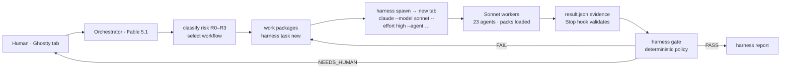

# Harness implementation report

Built 2026-09-05 against `00-ENGINEERING-ORCHESTRATOR.md`, `01-SDLC-ORCHESTRATION.md`, `02-SSDF-AGENTS.md`, `03-STANDARDS-PRACTICE-PACKS.md`, `04-EVIDENCE-AND-GATES.md`, `HARNESS-INTEGRATION.md`.

Operating model: you open cmux (Ghostty-based terminal with vertical tabs) in a project and start `claude`. That session is the Engineering Orchestrator (Fable 5.1). It spawns Sonnet (effort high) workers into new cmux workspaces (tabs) via cmux's socket CLI, waits for their evidence in the background, and evaluates a deterministic gate. It never blocks and never implements R1+ code itself.

## 0. Discovery and gap analysis (Steps 1–3 of the integration procedure)

Existing harness before this work: Claude Code 2.1.261 with default settings (`model: claude-fable-5-1[1m]`), no agents, no hooks, no CLAUDE.md, no skills, no CI. Ghostty not installed (VS Code terminal in use). Python 3.9, jq, tmux, osascript available.

| Capability | Before | After |
|---|---|---|
| Engineering orchestrator instructions | MISSING | `~/.claude/CLAUDE.md` + `/harness` skill |
| Request/risk classification | MISSING | `harness run new/set`, `harness classify` (deterministic path hints; orchestrator decides) |
| SDLC selection | MISSING | `workflows/registry.md` + 6 workflow definitions; default risk-based Agile+DevSecOps |
| Specialist routing / delegation | PARTIAL (Agent tool only, in-process) | 23 agent definitions + `harness task new` + `harness spawn` into terminal tabs |
| Separation of duties | MISSING | principal per agent; gate rules; PreToolUse hook makes reviewers read-only |
| Practice packs | MISSING | 18 packs + resolver `harness packs` + project overlay |
| Evidence contract | MISSING | `harness-result/1` schema, `harness result template/validate`, Stop hook |
| Policy gate | MISSING | `harness gate` (PASS/FAIL/NEEDS_HUMAN/NOT_APPLICABLE), `gate-policy.json` |
| Waivers / human approval | MISSING | `harness waiver`, `harness approve` (human-only; workers blocked) |
| Audit trail | MISSING | hash-chained `audit.jsonl`, `gate-history.jsonl` |
| Terminal-tab worker sessions | MISSING | cmux (socket CLI, primary), Ghostty (AppleScript), iTerm, Terminal, tmux, background backends |

Minimal-change principle: nothing in the user's existing settings was removed; `model`, `theme` and other keys were preserved. Only `hooks` and `env.HARNESS_HOME` were added.

## 1. Architecture

See `~/.claude/harness/docs/ARCHITECTURE.md` for the full Mermaid diagram, layer mapping and runtime layout.

## 2. Files created or modified

| Path | Purpose |
|---|---|
| `~/.claude/CLAUDE.md` | Orchestrator identity, absolute rules, step-by-step procedure, work-package template, tab etiquette (new) |
| `~/.claude/settings.json` | Added hooks (SessionStart banner, PreToolUse read-only/policy guard, Stop contract check) and `env.HARNESS_HOME` (modified) |
| `~/.claude/agents/*.md` (23 files) | Specialist agent definitions: Identity → Mission → Inputs → MUST → MUST NOT → Procedure → Evidence → Output → Handoff; `model: sonnet`; read-only agents restricted to Read/Grep/Glob/Bash |
| `~/.claude/skills/harness/SKILL.md` | `/harness <request>` end-to-end runbook |
| `~/.claude/skills/spawn/SKILL.md` | `/spawn` one worker into a tab |
| `~/.claude/skills/gate/SKILL.md` | `/gate` evaluate + route + report |
| `~/.claude/harness/bin/harness` (+ `~/.local/bin/harness` symlink) | Control-plane CLI: runs, classify, tasks, spawn, wait, status, result template/validate, packs, scan secrets/deps, waiver, approve, gate, report, hooks, doctor |
| `~/.claude/harness/config.json` | Worker model/effort/permission mode, terminal backend, Ghostty key bindings, cycle limit, R3 human approval |
| `~/.claude/harness/policy/gate-policy.json` | Risk profiles R0–R3, conditional roles, vulnerability chain, on_missing, finding thresholds, routes, SoD switches |
| `~/.claude/harness/schemas/result.schema.json` | Shared evidence contract `harness-result/1` |
| `~/.claude/harness/templates/worker-preamble.md` | Worker protocol appended to every worker system prompt (envelope injected) |
| `~/.claude/harness/templates/project-pack.md` | Per-repo policy overlay template (can declare `sdlc:`) |
| `~/.claude/harness/packs/*.md`, `packs/language/*.md`, `packs/registry.json`, `packs/README.md` | 18 practice packs + registry |
| `~/.claude/harness/workflows/*.md` | Registry with gate matrix; risk-based, agile, waterfall, devsecops, emergency, rollback |
| `~/.claude/harness/docs/ARCHITECTURE.md` | Architecture, registries, gaps |
| `~/.claude/harness/README.md` | User guide |
| `~/.claude/harness/tests/test_gate.py` | 39-check deterministic scenario suite |
| `<project>/.harness/` (created per run) | run.json, tasks/*, waivers, approvals, gate.json, audit.jsonl; auto-added to `.git/info/exclude` |

## 3. Agent registry

Full table in `docs/ARCHITECTURE.md`. Summary of IDs, role, parent, invocation, outputs:

| ID | Role | Parent | Invoked | Writes | Evidence |
|---|---|---|---|---|---|
| repo-context | context | Orchestrator | unfamiliar area | no | context map, untrusted-instruction findings |
| requirements | requirements | PO | R1+ | no | requirements.md |
| governance | governance | PO/PS | R2/R3 | no | role map, tool matrix, secrets-scan |
| threat-modeling | threat-model | PW.1 | R2/R3 | no | threat-model.md |
| architecture-review | architecture-review | PW.2 | R3 pre-impl | no | design mapping verdict |
| dependency-vetting | dependency-review | PW.4 | new/changed deps | no | audit output, verdict |
| ai-agent-security | domain-specialist | 218A | ai_scope≠none | no | trust boundaries, tool table |
| data-migration | domain-specialist/implementer | PW | schema/data | if assigned | migration runs |
| ci-cd-platform | domain-specialist/implementer | PW.6/PS.1 | pipeline/infra | if assigned | validated pipeline |
| secure-coding | implementer | PW.5 | R1+ | yes | patch, tests, scans |
| test-verification | test-verification | PW.8 | R1+ | no | executed suites |
| code-review | code-review | PW.7 | all | no | findings, verdict |
| security-review | security-review | PW.7 | R2/R3 | no | req/threat/evidence matrix |
| security-testing | security-testing | PW.8 | R2/R3 | no | negative tests |
| ai-adversarial-testing | ai-adversarial-testing | 218A | AI R2/R3 | no | attack cases |
| build-security | build-security | PW.6 | build path | no | build, hashes, CI review |
| secure-defaults | secure-defaults | PW.9 | R3/config | no | defaults table |
| release-integrity | release-integrity | PS.2/3 | release path | no | hashes, SBOM, gaps |
| vulnerability-discovery | vulnerability-discovery | RV.1 | vuln mode | no | record, repro |
| triage | triage | RV.2.1 | vuln mode | no | severity, criteria |
| remediation | remediation | RV.2.2 | vuln mode | yes | fix, before/after |
| root-cause | root-cause | RV.3 | R2+ vuln | no | cause/escape |
| regression-prevention | regression-prevention | RV.3 | R2+ vuln | tests/rules | before/after proof |

## 4. Workflow registry

`workflows/registry.md`. Default **risk-based Agile + DevSecOps**; Agile, Waterfall, DevSecOps selectable via repository declaration or user request; Emergency overlay and Rollback documented.

## 5. Practice pack registry

nist-ssdf · nist-ssdf-ai · secrets · owasp-appsec · owasp-llm · openssf-dependencies · supply-chain-provenance · web-api · auth-identity · cryptography · data-migration · ci-cd-build-integrity · ai-agent-tool-execution · vulnerability-response · release-integrity · language.python · language.javascript-typescript · language.go · project overlay (optional).

## 6. Gate matrix

In `workflows/registry.md`; enforced by `policy/gate-policy.json`. Mandatory: R0 implementer+code-review; R1 +requirements+test-verification; R2 +threat-model+security-review+security-testing+secrets scan; R3 +architecture-review (ordered before implementation)+secure-defaults+human approval, medium findings block. Conditional: dependency-review, domain-specialist, build-security, release-integrity, ai-adversarial-testing. Non-waivable: critical findings, author-as-reviewer, reviewer wrote files, stale review, failed required tests, invalid results.

## 7. Tests

`python3 ~/.claude/harness/tests/test_gate.py` → 39/39 checks pass, covering: R0 documentation (PASS; executable file → FAIL/reclassify), R1 normal change (PASS; MISSING roles; AUTHOR_IS_REVIEWER; REVIEWER_MODIFIED_FILES; STALE_REVIEW_EVIDENCE), R2 dependency/API (failed dependency review → retry; failed security test → remediation → re-verify → PASS), R3 auth + AI tool-use (pack loading; failed review with critical finding; non-waivable critical; medium blocks; waiver; NEEDS_HUMAN; approve → PASS WITH_WAIVERS; SoD; ordering), vulnerability-response chain, hooks, contract validation, scanners, classify, spawn dry-run, serialization, downgrade justification, audit chain.

Live smoke test: a real Sonnet `code-review` worker was spawned headlessly against a scratch repository; see the end of this report for its outcome.

## 8. Remaining gaps

Listed in `docs/ARCHITECTURE.md` → "Remaining gaps": cmux installed (v0.64.22) but its socket admits only processes started inside cmux, so live tab spawning must be verified by the user from a cmux tab (`harness doctor --tab-test`); the guard itself was verified (access denied from VS Code); principal identity by agent definition (no signing); dependency-review not bound to a manifest digest at gate time; heuristic built-in scanners; worker permission mode may need adjusting; polling-based coordination (10 s); single-principal approvals; emergency/rollback are procedures not automation.

## Live smoke test outcome (real Sonnet worker, headless backend)

Scratch repository with an uncommitted change adding `sub()` and an `os.system("echo " + cmd)` helper. Spawned `code-review` as a read-only worker (`claude --model sonnet --effort high --agent code-review`, work package as first prompt, protocol appended to the system prompt).

- The worker ran real commands (diff, `harness scan secrets`, test attempts, tool availability checks) and recorded each with exit codes; wrote `review.md`; reported **FAIL** with four individual findings: **critical** command injection in `run()` (blocking), **medium** out-of-scope change (blocking), two low advisory items; listed limitations honestly (pytest unavailable, no SAST).
- The Stop hook blocked the session until the result record validated (the first draft lacked finding `status` fields and an evidence reference; the worker corrected it).
- `harness gate` on the run returned **FAIL** with routes to `implementer` (critical finding), and MISSING_* for the roles a real R1 run would also need — exactly the behaviour intended for a change with an injection primitive.
- Two contract gaps found and fixed from this run: read-only roles now fail validation if they list `files_changed`; `summary` is now required; `harness wait` no longer returns a snapshot that has not validated yet.
