# 01-SDLC-ORCHESTRATION

> **Layer:** SDLC Workflow Orchestration
> **Position:** Below the Engineering Orchestrator; above specialist secure-development agents
> **Primary responsibility:** Determine **when** work occurs and **in what order**
> **Default:** Lightweight **Agile + DevSecOps** for normal AI-assisted coding unless repository, project, organizational, contractual, or regulatory instructions specify otherwise

## Purpose

The SDLC Orchestration layer controls the sequencing, iteration, gating, and lifecycle progression of engineering work performed by an AI-assisted coding harness.

It answers:

* **Which SDLC workflow should govern this change?**
* **Which lifecycle stage is active?**
* **What must happen before the change may advance?**
* **Which specialist secure-development agents must be invoked at this stage?**
* **When must earlier work be repeated because scope or risk changed?**
* **What happens when a gate fails?**
* **How are emergency fixes and rollbacks handled?**

This layer **does not perform specialist security work** and **does not replace security agents**.

The conceptual separation is:

| Layer                | Question answered                     | Responsibility                                                                          |
| -------------------- | ------------------------------------- | --------------------------------------------------------------------------------------- |
| **SDLC methodology** | **WHEN / ORDER**                      | Sequence stages, iterations, transitions, and gates                                     |
| **SSDF agents**      | **WHAT security work must happen**    | Perform or evaluate required secure-development activities                              |
| **Practice packs**   | **HOW controls may be implemented**   | Supply technology-, language-, framework-, or platform-specific implementation guidance |
| **Evidence gates**   | **PROOF that required work happened** | Verify artifacts, results, attestations, approvals, and required evidence               |

NIST SSDF is intentionally suitable for integration into existing development workflows rather than acting as a replacement SDLC. NIST describes the SSDF as secure development practices that can be integrated into existing workflows and automated toolchains and that are not specific to a particular SDLC model.  The ordering of SSDF practices is also explicitly not intended to imply an implementation sequence or relative importance. 

Accordingly:

> **The SDLC Orchestration layer owns sequence. Specialist security agents own security outcomes.**

Security work MUST be injected throughout the selected lifecycle rather than deferred to a single security phase. NIST notes that secure development practices should be integrated throughout the SDLC and that addressing security earlier reduces later remediation effort and technical debt. 

For AI-assisted development, AI-generated code MUST receive the same required verification treatment as human-written code. NIST SP 800-218A similarly does not distinguish between human-written and AI-generated source code for vulnerability and issue evaluation before use. 

### Normative Language

The terms **MUST**, **MUST NOT**, **SHOULD**, **SHOULD NOT**, and **MAY** are normative.

A repository or project MAY impose stricter requirements than this specification. It MUST NOT silently weaken mandatory organizational, regulatory, contractual, or security policy requirements.

---

# Position in Harness

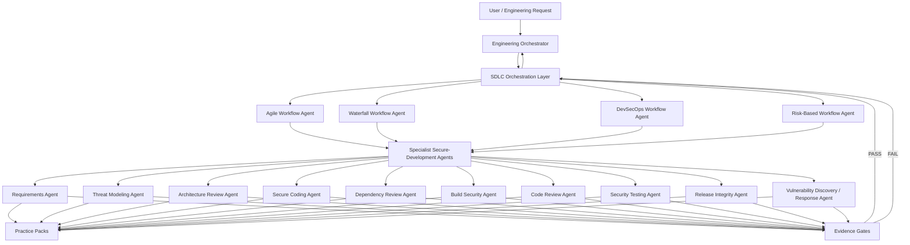

The Engineering Orchestrator determines **what engineering objective is being pursued**.

The SDLC Orchestration layer determines **the lifecycle path through which that objective is allowed to proceed**.

Specialist agents remain independently responsible for the secure-development activities assigned to their logical roles.

---

# Workflow Selection Algorithm

## Selection Principles

The workflow selector MUST evaluate, in order:

1. Repository-local instructions.
2. Project or workspace instructions.
3. Organizational policy.
4. Contractual or regulatory lifecycle requirements.
5. Explicit user-requested methodology.
6. Change impact and risk.
7. Delivery model and operational environment.
8. Existing repository workflow/tooling.
9. Default harness behavior.

More-specific valid instructions override the default methodology, but MUST NOT bypass mandatory security controls or evidence requirements.

## Default

When no stronger instruction applies:

> **Select lightweight Agile + DevSecOps.**

This means:

* Agile governs incremental planning and per-story/per-change iteration.
* DevSecOps governs the implementation-to-deployment pipeline.
* Security activities are injected continuously into both.
* Risk classification determines how deeply each security touchpoint executes.

The default is therefore a **composition**, not a choice between Agile and DevSecOps.

## Selection Decision Table

| Condition                                                                          | Primary selection                                                      |
| ---------------------------------------------------------------------------------- | ---------------------------------------------------------------------- |
| Repository explicitly defines lifecycle                                            | Repository-defined lifecycle, mapped to the closest supported workflow |
| Formal sequential contractual/regulatory phase approvals required                  | Waterfall                                                              |
| Product work proceeds through backlog/stories/short iterative changes              | Agile                                                                  |
| CI/CD, automated delivery, frequent deployment, or production telemetry is central | DevSecOps                                                              |
| Agile development with CI/CD                                                       | Agile + DevSecOps                                                      |
| Lifecycle depth must vary substantially according to risk                          | Risk-Based                                                             |
| Mixed methodology or custom lifecycle                                              | Risk-Based / Custom                                                    |
| Emergency remediation                                                              | Emergency Fix Workflow overlay                                         |
| Production restoration to known-good state                                         | Rollback Workflow                                                      |
| No explicit methodology and ordinary AI coding task                                | Lightweight Agile + DevSecOps                                          |

## Selection Algorithm

```text
function select_workflow(change, repository, project, policy):

    if repository.has_explicit_sdlc:
        workflow = map_repository_sdlc(repository.sdlc)

    else if project.has_explicit_sdlc:
        workflow = map_project_sdlc(project.sdlc)

    else if policy.requires_formal_sequential_gates:
        workflow = WATERFALL

    else if change.requires_custom_risk_scaled_lifecycle:
        workflow = RISK_BASED

    else if project.uses_backlog_iterations and project.uses_ci_cd:
        workflow = AGILE + DEVSECOPS

    else if project.uses_ci_cd:
        workflow = DEVSECOPS

    else if project.uses_backlog_iterations:
        workflow = AGILE

    else:
        workflow = AGILE + DEVSECOPS

    risk = classify_change(change)

    workflow = apply_risk_scaling(workflow, risk)

    if change.is_emergency:
        workflow = apply_emergency_fix_overlay(workflow)

    return workflow
```

## Selection Invariants

Regardless of selected workflow:

* Security MUST NOT be represented as one final lifecycle phase.
* Required specialist agents MUST be invoked at their applicable lifecycle injection points.
* Required evidence gates MUST be satisfied before protected transitions.
* A change MUST be reclassified when its effective scope or risk changes.
* A failed mandatory gate MUST NOT be treated as a successful gate.
* `not_applicable` MUST require an explicit rationale.
* Required earlier-stage work MUST be backfilled if late discoveries invalidate earlier assumptions.
* Generated code MUST NOT receive reduced scrutiny solely because it was produced by an AI coding agent.

NIST SSDF expects organizations to customize applicability and depth using factors such as risk, cost, feasibility, and applicability rather than treating the SSDF as a simple checklist. 

---

# Agile Workflow

## Agile Workflow Agent

### Purpose

The Agile Workflow Agent orchestrates small, iterative units of work such as:

* stories,
* tasks,
* defects,
* refactors,
* dependency updates,
* infrastructure changes,
* maintenance changes,
* AI-generated patches.

Security work MUST occur **inside each applicable story/change iteration**.

Agile MUST NOT be interpreted as:

```text
Develop everything → run security once → release
```

Instead:

```text
Story A → security touchpoints → verify
Story B → security touchpoints → verify
Story C → security touchpoints → verify
...
Release
```

### Inputs

* Change request or story
* Acceptance criteria
* Repository instructions
* Current backlog/sprint context
* Existing architecture/security context
* Risk classification
* Affected components
* Dependency changes
* Data classification
* Deployment target
* Prior security findings
* Required compliance/policy controls
* Available evidence from preceding iterations

### Outputs

* Selected story/change lifecycle
* Ordered stage plan
* Specialist-agent invocation plan
* Gate requirements
* Security acceptance criteria
* Evidence references
* Rework tasks
* Release eligibility state
* Updated risk classification
* Feedback items for backlog or subsequent iterations

### Stages

```text
Intake / Backlog Refinement
→ Story Ready
→ Design / Threat Analysis as Needed
→ Implement
→ Verify
→ Integrate / Release
→ Observe / Feedback
→ Next Story or Change
```

### Stage Rules

| Stage               | Entry criteria                                                                                       | Required security touchpoints                                   | Exit criteria                                                                |
| ------------------- | ---------------------------------------------------------------------------------------------------- | --------------------------------------------------------------- | ---------------------------------------------------------------------------- |
| Intake / Refinement | Change has identifiable intent                                                                       | Requirements Agent; initial risk classification                 | Security-relevant acceptance criteria and scope known                        |
| Story Ready         | Scope sufficiently understood                                                                        | Threat Modeling and/or Architecture Review when triggered       | Story is implementable without unresolved blocking design/security questions |
| Design              | Change affects trust boundaries, architecture, data flow, privilege, or other design-sensitive areas | Threat Modeling + Architecture Review                           | Relevant threats and design decisions addressed                              |
| Implement           | Story is ready                                                                                       | Secure Coding + Dependency Review when dependencies are touched | Implementation complete; known coding/dependency blockers addressed          |
| Verify              | Implemented candidate exists                                                                         | Code Review + Security Testing                                  | Required tests/reviews pass and evidence exists                              |
| Integrate / Release | Verification gates pass                                                                              | Build Security as applicable + Release Integrity                | Artifact/change approved for merge/deployment/release                        |
| Observe / Feedback  | Change is integrated or deployed                                                                     | Vulnerability Discovery / Response as applicable                | Findings routed to backlog, incident process, or new change iteration        |

### Entry Criteria

The Agile Workflow Agent MAY begin when:

* a story, bug, or change request has a meaningful objective;
* the affected repository or project has been identified; and
* enough information exists to perform initial classification.

The change does not need complete upfront requirements before entering Agile refinement.

### Exit Criteria

A story/change exits its iteration only when:

* acceptance criteria are satisfied;
* applicable mandatory security touchpoints have completed;
* required evidence gates pass;
* no unresolved blocking security finding remains;
* residual risk is handled according to policy;
* relevant documentation/evidence is attached;
* follow-up findings are either completed or explicitly moved into governed backlog work.

A sprint boundary MUST NOT itself waive incomplete security work.

### Required Security Touchpoints

At minimum, evaluate applicability for each story/change:

* **Refinement:** Requirements Agent
* **Design-sensitive change:** Threat Modeling Agent
* **Architecture-sensitive change:** Architecture Review Agent
* **Implementation:** Secure Coding Agent
* **Third-party/component change:** Dependency Review Agent
* **Build-impacting change:** Build Security Agent
* **Verification:** Code Review Agent
* **Security-sensitive behavior:** Security Testing Agent
* **Release/deployment:** Release Integrity Agent
* **Post-deployment:** Vulnerability Discovery / Response Agent

Applicability MAY be risk-scaled, but omission MUST be explicit where a touchpoint is normally expected.

### Feedback Loops

Agile MUST support:

```text
Verification failure → Implement
Design issue discovered during coding → Design
Requirement ambiguity → Refinement
Production finding → New story/change → Refinement
Dependency finding → Implement or Design
Threat-model finding → Design → Implement → Verify
```

Security findings MAY create:

* same-story rework,
* a blocking child task,
* a separately governed follow-up story,
* incident work,
* risk-acceptance review.

Blocking findings MUST NOT be deferred merely to preserve sprint velocity.

### Failure Paths

| Failure                             | Path                                                      |
| ----------------------------------- | --------------------------------------------------------- |
| Requirements incomplete             | Return to Refinement                                      |
| Threat model invalidates approach   | Return to Design                                          |
| Architecture review fails           | Redesign                                                  |
| Secure coding issue                 | Return to Implement                                       |
| Dependency rejected                 | Replace/update dependency or redesign                     |
| Tests/review fail                   | Return to Implement; rerun affected verification          |
| Release integrity fails             | Stop release; repair provenance/artifact pipeline         |
| Production vulnerability discovered | Vulnerability Response → new change or emergency workflow |

### When It Should Be Selected

Select Agile when:

* work is naturally decomposed into incremental changes;
* requirements evolve;
* frequent stakeholder feedback is expected;
* the repository uses issues, stories, sprints, or similar iterative planning;
* individual changes can be independently verified;
* AI coding work consists primarily of bounded modifications.

### When It Should NOT Be Selected

Do not select Agile as the sole methodology when:

* formal sequential lifecycle approvals are contractually required;
* a program requires immutable phase baselines before implementation;
* release occurs only after a complete, formally governed lifecycle;
* the project explicitly mandates another lifecycle;
* the work cannot meaningfully be divided into incremental units.

Agile MAY still appear inside a broader governed program if explicitly permitted.

## Agile Mermaid Diagram

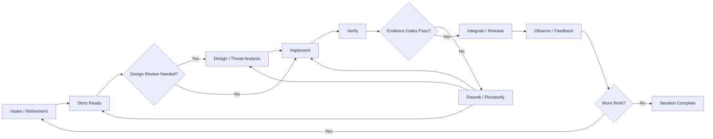

---

# Waterfall Workflow

## Waterfall Workflow Agent

### Purpose

The Waterfall Workflow Agent manages formal sequential lifecycle phases with explicit phase baselines and advancement gates.

The required lifecycle is:

```text
Requirements
→ Design
→ Implementation
→ Verification
→ Release
→ Maintenance
```

Security is incorporated into every applicable phase; it is not appended after Verification.

### Inputs

* Project charter/scope
* Formal requirements
* Contractual or regulatory obligations
* Security requirements
* Architecture constraints
* Risk classification
* Required approval authorities
* Verification plan
* Release criteria
* Maintenance obligations
* Evidence/attestation requirements

### Outputs

* Phase plan
* Phase baselines
* Gate definitions
* Required specialist invocations
* Approval/evidence records
* Rework decisions
* Release authorization state
* Maintenance transition package

### Stages

#### 1. Requirements

**Entry criteria**

* Project/change authorized for requirements analysis.
* Scope owner identifiable.
* Applicable policy/contract sources available.

**Security touchpoints**

* Requirements Agent

**Exit criteria**

* Functional and non-functional requirements baselined.
* Security requirements identified.
* Security-relevant assumptions documented.
* Requirements evidence gate passes.

#### 2. Design

**Entry criteria**

* Requirements Gate passed.

**Security touchpoints**

* Threat Modeling Agent
* Architecture Review Agent

**Exit criteria**

* Architecture/design baseline exists.
* Applicable threat analysis complete.
* Blocking design findings resolved.
* Design evidence gate passes.

#### 3. Implementation

**Entry criteria**

* Design Gate passed.

**Security touchpoints**

* Secure Coding Agent
* Dependency Review Agent
* Build Security Agent where build/toolchain work occurs

**Exit criteria**

* Implementation corresponds to approved design.
* Required component/dependency reviews complete.
* Buildable implementation exists.
* Implementation gate passes.

#### 4. Verification

**Entry criteria**

* Implementation Gate passed.

**Security touchpoints**

* Code Review Agent
* Security Testing Agent
* Build Security Agent where artifact/build verification is required

**Exit criteria**

* Verification plan executed.
* Required security tests/reviews pass.
* Blocking findings resolved.
* Verification evidence gate passes.

#### 5. Release

**Entry criteria**

* Verification Gate passed.

**Security touchpoints**

* Release Integrity Agent

**Exit criteria**

* Approved artifact identified.
* Release provenance/integrity evidence available.
* Release authorization obtained.
* Release Gate passes.

#### 6. Maintenance

**Entry criteria**

* Release completed or system accepted into maintenance.

**Security touchpoints**

* Vulnerability Discovery / Response Agent
* Other specialists when maintenance changes trigger them

**Exit criteria**

Maintenance is normally ongoing. A specific maintenance change exits when:

* finding/change is resolved or accepted;
* applicable regression gates pass;
* resulting release or closure evidence exists.

### Entry Criteria

Use of Waterfall requires an identifiable project scope and enough governance information to define formal gates and approval authorities.

### Exit Criteria

The lifecycle exits when:

* the release has passed formal acceptance; and
* the product/component has transitioned into governed maintenance, decommissioning, or another approved lifecycle.

### Required Security Touchpoints

```text
Requirements   → Requirements Agent
Design         → Threat Modeling + Architecture Review
Implementation → Secure Coding + Dependency Review
Verification   → Code Review + Security Testing
Release        → Release Integrity
Maintenance    → Vulnerability Discovery / Response
```

Build Security is invoked in Implementation and/or Verification according to where build artifacts and pipelines are created or evaluated.

### Feedback Loops

Waterfall is sequential but MUST allow controlled backward transitions.

Examples:

```text
Verification finding → Implementation
Implementation reveals design defect → Design
Design reveals missing requirement → Requirements
Release integrity failure → Implementation / Verification / Release preparation
Maintenance vulnerability → Requirements or Design for remediation
```

Backward transitions MUST invalidate affected downstream approvals as appropriate.

### Failure Paths

A phase gate failure MUST:

1. stop forward progression;
2. record the failed criterion;
3. identify the responsible specialist or engineering owner;
4. return to the earliest phase invalidated by the finding;
5. repeat all affected downstream gates.

### When It Should Be Selected

Select Waterfall when:

* formal phase approval is required;
* deliverables are contractually baselined;
* change control requires sequential authorization;
* regulatory processes mandate phase gates;
* hardware/software integration or long-lead activities require stable upstream design;
* repository/project policy explicitly mandates Waterfall.

### When It Should NOT Be Selected

Do not select Waterfall by default for:

* routine AI coding changes;
* fast-moving product iteration;
* continuously delivered services;
* experimental work with rapidly evolving requirements;
* projects whose normal workflow is issue-driven CI/CD.

## Waterfall Mermaid Diagram

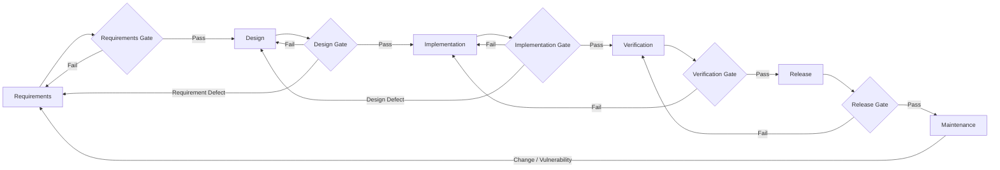

---

# DevSecOps Workflow

## DevSecOps Workflow Agent

### Purpose

The DevSecOps Workflow Agent coordinates continuous engineering and security activities through the software delivery and operational feedback pipeline.

Required lifecycle:

```text
Plan
→ Design
→ Code
→ Build
→ Test
→ Release
→ Monitor
→ Feedback
```

The workflow SHOULD automate repeatable evidence and controls where suitable, while preserving specialist-agent ownership of the security decision.

### Inputs

* Planned change
* Repository state
* Pipeline definition
* Deployment topology
* Risk classification
* Architecture context
* Dependency manifest
* Build configuration
* Security/test policy
* Release policy
* Production telemetry/findings
* Prior pipeline evidence

### Outputs

* Ordered pipeline-stage plan
* Required security-agent invocations
* Automated/manual gate requirements
* Build/test/release evidence
* Deployment eligibility
* Monitoring feedback
* Remediation/reclassification events

### Stages

| Stage    | Entry criteria                   | Security touchpoints                                  | Exit criteria                                      |
| -------- | -------------------------------- | ----------------------------------------------------- | -------------------------------------------------- |
| Plan     | Change identified                | Requirements Agent                                    | Scope and security acceptance criteria established |
| Design   | Design-affecting work identified | Threat Modeling + Architecture Review when applicable | Design risks addressed                             |
| Code     | Implementation authorized        | Secure Coding + Dependency Review                     | Candidate change complete                          |
| Build    | Buildable candidate exists       | Build Security                                        | Trusted build evidence produced                    |
| Test     | Build/test candidate exists      | Code Review + Security Testing                        | Required verification passes                       |
| Release  | Test gates pass                  | Release Integrity                                     | Approved artifact/change deployed or published     |
| Monitor  | Release observable               | Vulnerability Discovery / Response                    | Findings classified and routed                     |
| Feedback | Telemetry/findings available     | Relevant specialists according to finding             | New change enters Plan                             |

### Entry Criteria

DevSecOps may begin when:

* the project has a delivery pipeline or analogous build/test/release process;
* the change can flow through automated or repeatable stages; and
* operational or release feedback can be connected to future work.

### Exit Criteria

DevSecOps is cyclical. A single change exits when:

* the intended release/deployment completes;
* mandatory gates pass;
* post-release observation obligations are registered;
* unresolved findings are routed into governed feedback work.

### Required Security Touchpoints

```text
Plan     → Requirements Agent
Design   → Threat Modeling + Architecture Review
Code     → Secure Coding + Dependency Review
Build    → Build Security
Test     → Code Review + Security Testing
Release  → Release Integrity
Monitor  → Vulnerability Discovery / Response
Feedback → Reclassification + appropriate earlier specialist agents
```

### Feedback Loops

DevSecOps MUST support fast backward routing.

Examples:

```text
Build failure → Code or Build configuration
Test failure → Code
Release integrity failure → Build / Release
Production vulnerability → Plan
Threat change → Design
Dependency alert → Plan or Code
Operational anomaly → Vulnerability Response → Plan
```

Feedback MUST be capable of changing risk classification.

### Failure Paths

* **Build Security failure:** artifact MUST NOT advance to Test/Release as a trusted build.
* **Security Test failure:** change returns to Code or Design.
* **Release Integrity failure:** deployment/publication stops.
* **Monitoring finding:** classify and route through normal change, emergency fix, rollback, or incident path.
* **Pipeline compromise suspicion:** stop affected delivery path and invoke applicable response/integrity roles before resuming.

### When It Should Be Selected

Select DevSecOps when:

* CI/CD exists;
* frequent integration/deployment occurs;
* infrastructure and pipeline controls are part of delivery;
* automated testing is central;
* operational feedback influences engineering;
* the project is a continuously operated service.

### When It Should NOT Be Selected

Do not treat DevSecOps as the complete workflow when:

* formal sequential governance requires Waterfall gates that the pipeline cannot replace;
* the project has no meaningful build/test/release or operational pipeline;
* work is purely conceptual and has not reached an implementation lifecycle;
* project instructions mandate another process.

DevSecOps MAY still be embedded within Implementation/Verification portions of a broader lifecycle.

## DevSecOps Mermaid Diagram

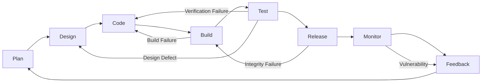

---

# Risk-Based Workflow

## Risk-Based Workflow Agent

### Purpose

The Risk-Based Workflow Agent creates a lifecycle whose depth and formality expand or contract according to:

* impact,
* likelihood,
* exposure,
* affected assets,
* privilege,
* data sensitivity,
* supply-chain implications,
* deployment scope,
* reversibility,
* novelty,
* known threat activity,
* organizational requirements.

The workflow MAY operate:

1. as a standalone/custom methodology; or
2. as an overlay that scales Agile, Waterfall, or DevSecOps.

Risk scaling changes the **depth and required evidence**, not the ownership boundaries between orchestration and specialist security agents.

NIST SSDF specifically recognizes that applicability and implementation formality may vary and recommends considering risk, cost, feasibility, and applicability when tailoring secure-development practices. 

### Inputs

* Proposed change
* Initial risk assessment
* Asset criticality
* Data sensitivity
* External exposure
* Trust-boundary changes
* Authentication/authorization impact
* Dependency/supply-chain impact
* Deployment scope
* Reversibility
* Compliance requirements
* Threat intelligence/findings
* Existing control/evidence coverage
* Repository/project rules

### Outputs

* Risk tier
* Tailored lifecycle
* Expanded or collapsed stages
* Required specialist-agent set
* Required evidence depth
* Required human/authority approvals
* Reclassification triggers
* Release constraints
* Monitoring obligations

### Stages

Logical stages are:

```text
Classify
→ Scope
→ Plan / Design
→ Implement
→ Verify
→ Release / Close
→ Observe
```

Stages MAY be collapsed for low-impact changes or expanded into multiple gated activities for high-risk changes.

### Example Scaling

| Risk level | Typical lifecycle treatment                                                                                                                                              |
| ---------- | ------------------------------------------------------------------------------------------------------------------------------------------------------------------------ |
| Low        | Lightweight plan → implement → automated/relevant verification → release                                                                                                 |
| Moderate   | Requirements check → design consideration → implement → code/dependency review → security testing → release evidence                                                     |
| High       | Formal requirements → threat model → architecture review → implementation controls → build security → independent verification → release integrity → enhanced monitoring |
| Critical   | Formal high-assurance lifecycle, explicit approvals, comprehensive evidence, potentially Waterfall-style phase gates or specialized project policy                       |

Risk labels are illustrative; repository or organizational policy MAY define different classifications.

### Entry Criteria

Risk-Based Workflow begins when:

* a change can be scoped enough for initial impact/risk analysis; and
* either policy, project context, or the workflow selector requires lifecycle tailoring.

### Exit Criteria

The change exits when:

* required stages for its final risk classification are complete;
* applicable specialist agents have completed;
* evidence for each mandatory gate exists;
* release/closure conditions are satisfied;
* monitoring/follow-up obligations are registered where applicable.

### Required Security Touchpoints

Risk determines **which applicable touchpoints are mandatory and how deep they run**.

Typical expansion:

```text
Low:
  Secure Coding
  Code Review / applicable tests

Moderate:
  Requirements
  Secure Coding
  Dependency Review
  Code Review
  Security Testing
  Release Integrity as applicable

High / Critical:
  Requirements
  Threat Modeling
  Architecture Review
  Secure Coding
  Dependency Review
  Build Security
  Code Review
  Security Testing
  Release Integrity
  Vulnerability Discovery / Response
```

This table MUST NOT override touchpoints made mandatory by the nature of the change. For example, a dependency change still invokes Dependency Review even if the overall patch is small.

### Feedback Loops

Any stage may cause reclassification.

```text
New data sensitivity → Reclassify
New internet exposure → Reclassify
New privileged operation → Reclassify
Unexpected dependency → Reclassify
Security finding → Reclassify
Changed deployment scope → Reclassify
Incident context → Reclassify
```

When risk increases, the orchestrator MUST determine whether earlier omitted activities must be backfilled.

### Failure Paths

* Insufficient information → remain in classification/scope.
* Risk cannot be bounded → choose the more conservative lifecycle.
* Required control cannot be satisfied → stop at gate.
* Risk exceeds autonomous authority → escalate to designated approval authority.
* Newly identified high-risk characteristic → expand lifecycle and backfill missing stages.
* Approved risk exception → record exception and continue only where policy permits.

### When It Should Be Selected

Select Risk-Based Workflow when:

* change types vary dramatically in impact;
* a custom methodology is required;
* a one-size-fits-all lifecycle would be unnecessarily heavy or dangerously light;
* project instructions explicitly call for risk-scaled controls;
* the change crosses multiple engineering methodologies;
* unusual technology or deployment conditions require lifecycle tailoring.

### When It Should NOT Be Selected

Do not use Risk-Based Workflow to:

* bypass required organizational controls;
* eliminate inconvenient security work without documented rationale;
* override formal Waterfall gates required by contract;
* downgrade a change merely because the code diff is small;
* convert mandatory evidence into optional evidence.

## Risk-Based Mermaid Diagram

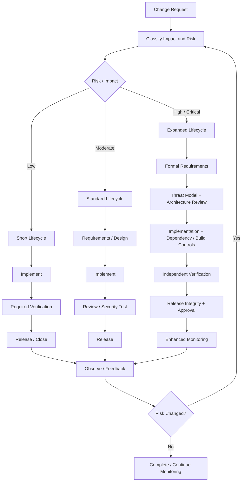

---

# Phase Gates

A **phase gate** governs progression between lifecycle stages.

An **evidence gate** proves that mandatory work associated with that transition occurred.

The SDLC Orchestration layer MUST NOT substitute its own judgment for the specialist agent's security conclusion when the specialist role owns that conclusion.

## Standard Gate Outcomes

Every mandatory gate MUST resolve to one of:

| Outcome              | Meaning                                                                    |
| -------------------- | -------------------------------------------------------------------------- |
| `pass`               | All mandatory criteria satisfied                                           |
| `fail`               | One or more mandatory criteria unsatisfied                                 |
| `not_applicable`     | Gate or criterion does not apply; rationale recorded                       |
| `exception_approved` | Authorized exception/risk acceptance exists and policy permits progression |
| `pending`            | Required work or evidence incomplete                                       |

`pending` is not equivalent to `pass`.

`not_applicable` MUST include:

* applicability rationale;
* decision source;
* affected scope;
* evidence or facts supporting the determination.

`exception_approved` MUST include:

* approving authority;
* scope;
* reason;
* residual risk;
* expiration/review condition where applicable.

## Gate Invariant

```text
Forward transition permitted
ONLY IF
all mandatory gates ∈ {pass, not_applicable, exception_approved}
AND policy allows the resulting combination.
```

## Typical Phase Gates

| Gate                | Example required evidence                       |
| ------------------- | ----------------------------------------------- |
| Requirements Gate   | Approved requirements/security criteria         |
| Design Gate         | Threat-model/architecture disposition           |
| Implementation Gate | Coding/dependency/build evidence                |
| Verification Gate   | Review and security-test results                |
| Release Gate        | Artifact provenance/integrity and authorization |
| Operational Gate    | Monitoring/response readiness when required     |

Evidence format is defined by the evidence system and specialist agents, not by this orchestration layer.

---

# Security Injection Points

The following mappings define **logical invocation points**, not the detailed responsibilities of each agent.

| Lifecycle concern                               | Specialist role                              |
| ----------------------------------------------- | -------------------------------------------- |
| Requirements / planning                         | **Requirements Agent**                       |
| Threat identification / trust-boundary analysis | **Threat Modeling Agent**                    |
| Architecture/security design review             | **Architecture Review Agent**                |
| Source implementation                           | **Secure Coding Agent**                      |
| Third-party packages/components                 | **Dependency Review Agent**                  |
| Build system/artifact generation                | **Build Security Agent**                     |
| Source/change review                            | **Code Review Agent**                        |
| Security-focused verification                   | **Security Testing Agent**                   |
| Publishing/deployment/artifact integrity        | **Release Integrity Agent**                  |
| Post-release vulnerabilities                    | **Vulnerability Discovery / Response Agent** |

## Invocation Rules

### Requirements Agent

Invoke when:

* a new feature/change is planned;
* security acceptance criteria may be required;
* external requirements apply;
* a change alters security-relevant behavior;
* prior assumptions or requirements are invalidated.

### Threat Modeling Agent

Invoke when the change introduces or materially changes:

* trust boundaries;
* data flows;
* external exposure;
* authentication/authorization behavior;
* privilege;
* attack surface;
* security-sensitive protocols;
* critical integration behavior;
* architecture assumptions.

### Architecture Review Agent

Invoke when:

* components/services are added or materially restructured;
* security boundaries change;
* isolation assumptions change;
* new privileged services/interfaces appear;
* a threat-model finding requires design evaluation.

### Secure Coding Agent

Invoke for implementation changes where secure coding requirements are applicable.

AI generation does not remove this invocation requirement.

### Dependency Review Agent

Invoke when:

* a dependency is added;
* a dependency version changes;
* a transitive dependency changes materially;
* a package source changes;
* vendored or externally supplied code is introduced;
* dependency policy requires periodic re-evaluation.

### Build Security Agent

Invoke when:

* build configuration changes;
* CI configuration changes;
* artifact generation is security relevant;
* signing/provenance/build isolation requirements apply;
* build dependencies/toolchains change.

### Code Review Agent

Invoke before acceptance of relevant implementation changes according to project policy and risk level.

### Security Testing Agent

Invoke when:

* security acceptance criteria require validation;
* exposed behavior changes;
* authentication/authorization changes;
* validation/parsing boundaries change;
* cryptographic or secrets-related behavior changes;
* risk classification requires specialized testing;
* another specialist identifies required security tests.

### Release Integrity Agent

Invoke before protected release/deployment transitions when artifact identity, provenance, signing, authorization, or distribution integrity applies.

### Vulnerability Discovery / Response Agent

Invoke when:

* a vulnerability is discovered or reported;
* monitoring detects a security-relevant condition;
* a released component becomes affected by a new dependency vulnerability;
* a security incident or exploit changes remediation urgency.

---

# Iteration Rules

1. **Security follows the unit of change.**
   In iterative workflows, required security touchpoints repeat for every story/change for which they are applicable.

2. **Prior evidence MAY be reused only when still valid.**
   Reuse requires that assumptions, affected scope, architecture, dependencies, and risk remain sufficiently unchanged.

3. **Changed assumptions invalidate dependent evidence.**
   The orchestrator MUST determine which earlier gates must be rerun.

4. **A stage MAY repeat multiple times.**
   There is no requirement that lifecycle stages execute exactly once.

5. **Backward movement is normal.**
   Discovery of a defect during Test MAY return work to Code, Design, or Requirements.

6. **Forward skipping requires explicit justification.**
   A skipped optional stage MUST be recorded. A mandatory stage cannot be silently skipped.

7. **Small diff does not imply low risk.**
   One-line changes to authorization, cryptography, package provenance, permissions, or release infrastructure MAY require an expanded lifecycle.

8. **Large diff does not automatically imply critical risk.**
   Mechanical changes MAY qualify for a shortened workflow if policy and impact analysis support that classification.

9. **Verification applies to the final effective change.**
   Evidence from an earlier revision MUST NOT be treated as proving a materially modified revision.

10. **Feedback creates new lifecycle work.**
    Operational findings return through classification instead of being patched outside governance.

---

# Change Reclassification

A change MUST be reclassified whenever material facts change.

## Mandatory Reclassification Triggers

Reclassification is required when a change begins to affect any previously unrecognized area including:

* authentication;
* authorization;
* privilege boundaries;
* cryptography;
* secrets;
* sensitive data;
* data classification;
* external/network exposure;
* trust boundaries;
* persistence or schema;
* security configuration;
* third-party dependencies;
* build or CI/CD infrastructure;
* artifact provenance;
* deployment permissions;
* public APIs;
* critical business functions;
* infrastructure-as-code;
* sandbox boundaries;
* AI agent/tool permissions;
* model or external service integrations;
* production scope;
* incident response;
* an active vulnerability.

## Reclassification Behavior

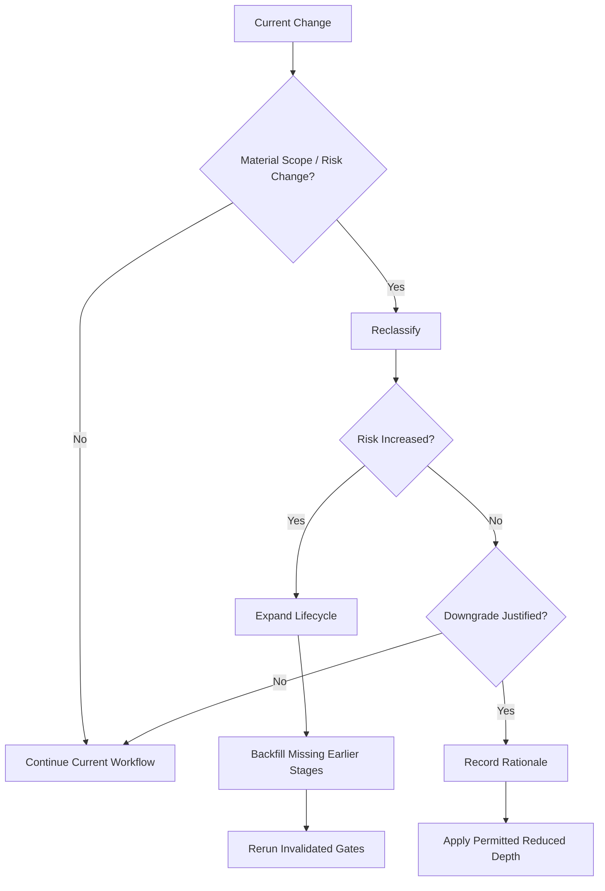

### Reclassification Rules

* Risk increases take effect immediately.
* Required earlier stages MUST be backfilled before release.
* Existing evidence remains usable only if its underlying assumptions remain valid.
* Risk downgrade MUST be justified by evidence.
* Reclassification MUST NOT erase previous findings.
* A change MUST NOT remain artificially classified as low-risk to preserve an abbreviated workflow.

---

# Emergency Fix Workflow

Emergency fixes accelerate sequencing; they do **not** abolish secure-development obligations.

Use this workflow when delay creates greater immediate risk than the normal lifecycle, such as:

* active exploitation;
* severe production vulnerability;
* major security incident;
* critical service restoration;
* urgent containment.

## Emergency Sequence

```text
Confirm Emergency
→ Classify Immediate Risk
→ Contain / Consider Rollback
→ Define Minimum Safe Change
→ Implement
→ Minimum Mandatory Verification
→ Release Integrity Check
→ Emergency Release
→ Monitor
→ Backfill Deferred Lifecycle Work
→ Post-Incident Follow-up
```

## Minimum Requirements

An emergency fix MUST, unless technically impossible:

* establish the emergency rationale;
* identify affected scope;
* invoke Vulnerability Discovery / Response;
* use Secure Coding for the patch;
* perform Code Review appropriate to the emergency;
* perform targeted Security Testing;
* evaluate dependencies/build security if affected;
* perform Release Integrity checks;
* monitor deployment results;
* record any deferred non-essential activity;
* schedule required backfill.

Mandatory controls MAY be deferred only where policy explicitly permits emergency exception handling.

Deferred work MUST NOT silently disappear after service restoration.

## Emergency Mermaid Diagram

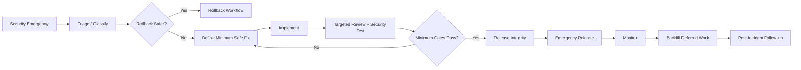

---

# Rollback Workflow

Rollback restores a previously acceptable state when continuing with the current release creates unacceptable reliability, security, or integrity risk.

## Triggers

Rollback MAY be initiated for:

* exploitable vulnerability;
* release integrity failure;
* severe operational regression;
* security-control failure;
* failed deployment;
* compromised artifact suspicion;
* emergency containment.

## Sequence

```text
Trigger
→ Freeze Affected Forward Deployment
→ Identify Known-Good Target
→ Validate Rollback Artifact / State
→ Authorize Rollback
→ Restore
→ Verify Restoration
→ Monitor
→ Determine Root Cause
→ Re-enter Normal SDLC for Corrective Change
```

## Rules

* A rollback target MUST be identifiable and approved according to release policy.
* Release Integrity MUST be evaluated when artifact integrity is relevant.
* A version suspected of compromise MUST NOT be treated as known-good merely because it was previously deployed.
* Database/data migrations MUST consider rollback safety before state restoration.
* Rollback does not close the originating vulnerability or defect.
* Corrective engineering MUST enter the appropriate normal or emergency SDLC path after restoration.

## Rollback Mermaid Diagram

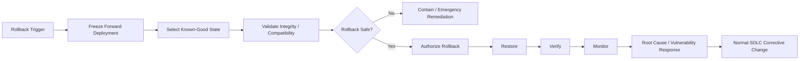

---

# Failed-Gate Behavior

A failed mandatory gate MUST stop the protected forward transition.

## Required Response

On failure, the orchestrator MUST:

1. Record the failed gate and criteria.
2. Preserve associated evidence.
3. Determine whether the failure is:

   * implementation-local,
   * verification-local,
   * design-invalidating,
   * requirements-invalidating,
   * build/release-integrity-related,
   * operational,
   * caused by changed risk/scope.
4. Invoke the specialist role responsible for resolving or evaluating the issue.
5. Route work to the earliest lifecycle stage invalidated.
6. Re-run affected downstream stages.
7. Obtain fresh evidence before retrying the blocked transition.

## Routing Matrix

| Failure source                          | Typical return stage                                  |
| --------------------------------------- | ----------------------------------------------------- |
| Missing acceptance/security requirement | Requirements / Plan                                   |
| Threat-model defect                     | Design                                                |
| Architecture defect                     | Design                                                |
| Coding defect                           | Code / Implementation                                 |
| Dependency issue                        | Code / Implementation or Design                       |
| Build integrity issue                   | Build / Implementation                                |
| Code review issue                       | Code / Implementation                                 |
| Security test failure                   | Code, Design, or Requirements depending on root cause |
| Release integrity failure               | Build / Release preparation                           |
| Production vulnerability                | Feedback / Plan or Emergency Workflow                 |

## Exceptions

The orchestrator MUST NOT create its own security waiver.

If an exception mechanism is allowed:

```text
Gate fails
→ Exception requested
→ Authorized authority evaluates residual risk
→ Exception approved or denied
```

An approved exception MUST be explicit evidence, not an inferred permission.

High-severity conditions MUST follow organizational escalation requirements.

---

# Example Flows

## Example 1 — Normal AI-Generated Feature Change

**Scenario:** An AI coding harness adds a small authenticated API feature in a repository using pull requests and CI/CD.

**Selected workflow:** Agile + DevSecOps.

```text
Story / Change Intake
→ Requirements Agent
→ Risk classification detects authentication involvement
→ Threat Modeling
→ Architecture Review if trust boundary changes
→ Secure Coding
→ Dependency Review if package changes occur
→ Build Security through CI
→ Code Review
→ Security Testing
→ Release Integrity
→ Deploy
→ Monitor
→ Feedback
```

Security work occurs in this individual story iteration rather than waiting until the end of a sprint or release train.

---

## Example 2 — Documentation-Only Low-Risk Change

**Scenario:** Correct spelling and examples in internal documentation with no executable behavior, deployment configuration, dependency, or security policy change.

**Selected workflow:** Risk-scaled lightweight Agile.

```text
Classify
→ Confirm non-executable / low impact
→ Edit
→ Review
→ Evidence gate
→ Merge
```

Specialist security activities MAY be marked `not_applicable` where justified.

A documentation change that alters security requirements, deployment instructions, secrets handling, or operational controls would be reclassified.

---

## Example 3 — High-Risk Authorization Change

**Scenario:** Modify tenant isolation and authorization logic.

**Selected workflow:** Agile + DevSecOps with expanded Risk-Based controls.

```text
Plan
→ Requirements Agent
→ High-risk classification
→ Threat Modeling
→ Architecture Review
→ Implement with Secure Coding
→ Dependency Review
→ Build Security
→ Code Review
→ Security Testing
→ Verification Gate
→ Release Integrity
→ Controlled Release
→ Enhanced Monitoring
→ Feedback
```

A small code diff does not shorten the workflow because the impact affects a trust boundary.

---

## Example 4 — Formal Regulated Release

**Scenario:** A project contract requires approved requirements and design baselines before implementation.

**Selected workflow:** Waterfall.

```text
Requirements
→ Requirements Gate
→ Design
→ Threat Model + Architecture Review
→ Design Gate
→ Implementation
→ Secure Coding + Dependency / Build Security
→ Implementation Gate
→ Verification
→ Code Review + Security Testing
→ Verification Gate
→ Release Integrity
→ Release Gate
→ Maintenance
```

---

## Example 5 — Critical Production Vulnerability

**Scenario:** Active exploitation affects a production endpoint.

**Selected workflow:** Emergency Fix Workflow over the existing project methodology.

```text
Vulnerability Response
→ Determine containment / rollback viability
→ Minimum safe patch
→ Secure Coding
→ Targeted Code Review
→ Targeted Security Testing
→ Build / Release Integrity
→ Emergency deploy
→ Monitor
→ Backfill any authorized deferred work
→ Root-cause remediation through normal SDLC
```

---

# Mermaid Diagrams

## Default Agile + DevSecOps Composition

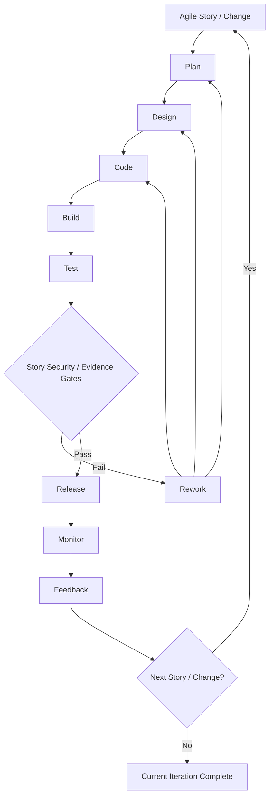

## Security Injection Model

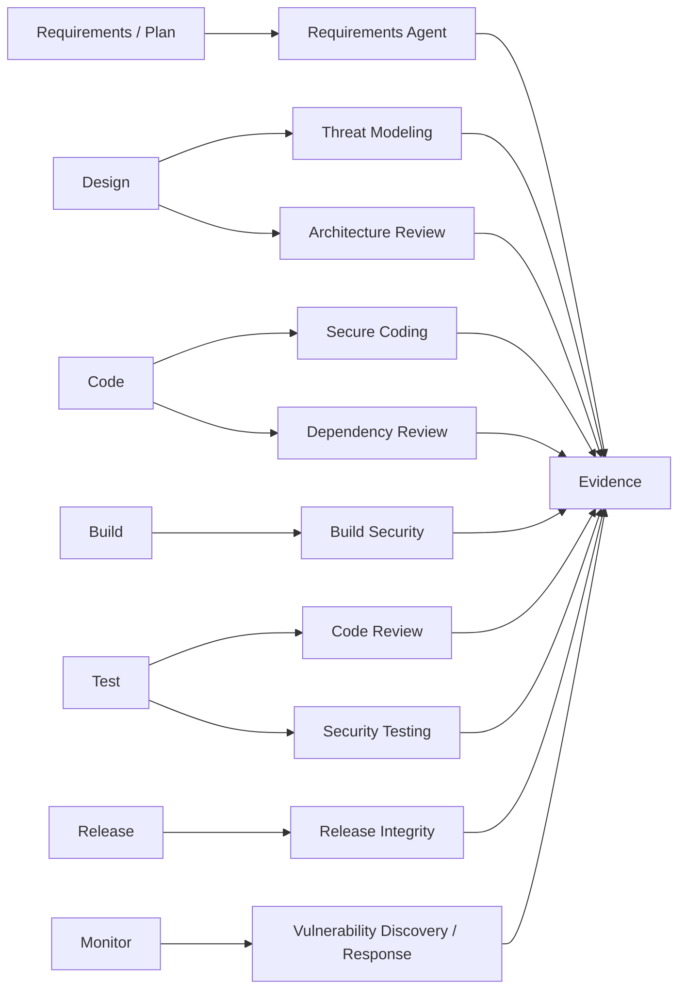

## Universal Lifecycle Transition Model

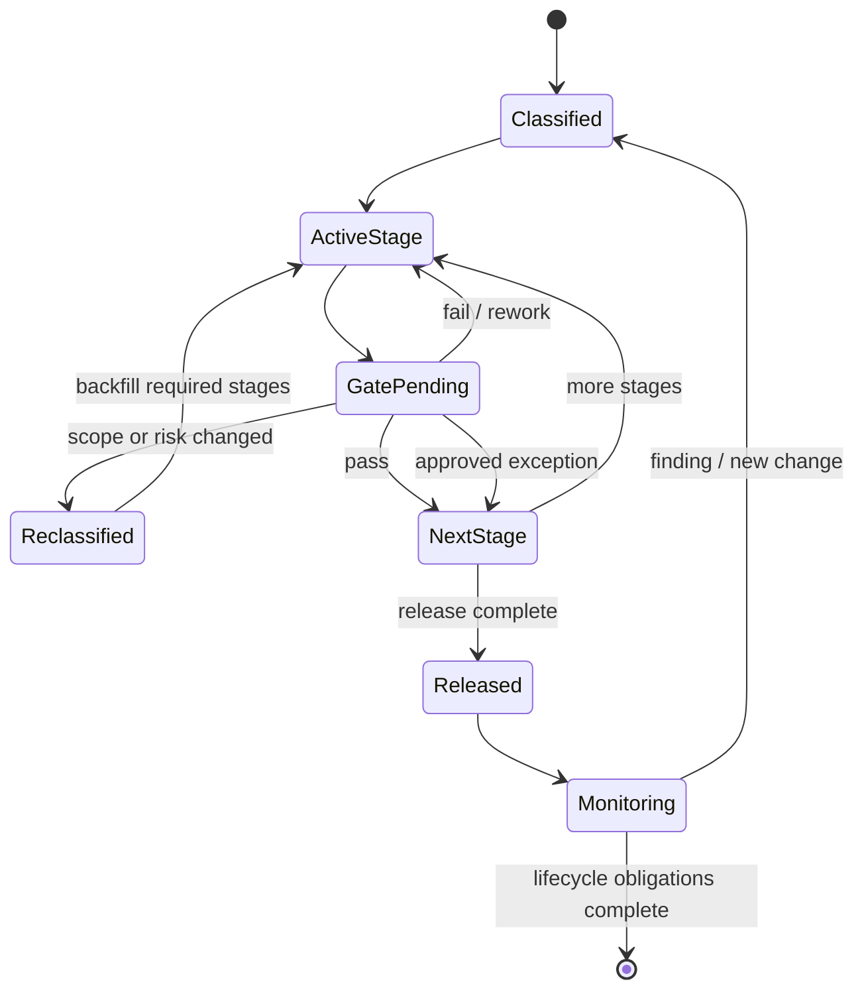

---

# Machine-Readable Workflow Contract

The following contract defines the minimum orchestration interface between the Engineering Orchestrator, SDLC Workflow Agents, specialist security agents, and evidence gates.

```yaml
spec:
  id: "01-SDLC-ORCHESTRATION"
  version: "1.0"
  layer: "sdlc-workflow-orchestration"

  responsibility:
    owns:
      - workflow_selection
      - stage_order
      - stage_transition
      - iteration
      - change_reclassification
      - specialist_invocation_timing
      - phase_gate_enforcement
      - failed_gate_routing
      - emergency_flow_selection
      - rollback_flow_selection

    does_not_own:
      - specialist_security_analysis
      - control_implementation_details
      - evidence_generation_by_specialists
      - security_waiver_authority

  conceptual_separation:
    sdlc_methodology: "WHEN_AND_ORDER"
    ssdf_agents: "WHAT_SECURITY_WORK"
    practice_packs: "HOW_CONTROLS_MAY_BE_IMPLEMENTED"
    evidence_gates: "PROOF_WORK_OCCURRED"

defaults:
  normal_ai_coding:
    workflows:
      - agile
      - devsecops
    mode: "composed"
    risk_scaling: true

workflow_selection:
  precedence:
    - repository_instruction
    - project_instruction
    - organization_policy
    - contractual_requirement
    - regulatory_requirement
    - explicit_user_methodology
    - risk_and_impact
    - delivery_model
    - repository_convention
    - default

  rules:
    - when: "formal_sequential_gates_required"
      select:
        - waterfall

    - when: "custom_or_materially_risk_scaled_lifecycle_required"
      select:
        - risk_based

    - when: "iterative_backlog AND ci_cd"
      select:
        - agile
        - devsecops
      mode: "composed"

    - when: "ci_cd AND NOT iterative_backlog"
      select:
        - devsecops

    - when: "iterative_backlog AND NOT ci_cd"
      select:
        - agile

    - when: "no_stronger_rule"
      select:
        - agile
        - devsecops
      mode: "composed"

workflows:

  agile:
    agent: "Agile Workflow Agent"

    stages:
      - id: intake_refinement
        security_touchpoints:
          - requirements_agent

      - id: story_ready
        security_touchpoints:
          - threat_modeling_agent_if_triggered
          - architecture_review_agent_if_triggered

      - id: design
        optional: true
        security_touchpoints:
          - threat_modeling_agent
          - architecture_review_agent

      - id: implement
        security_touchpoints:
          - secure_coding_agent
          - dependency_review_agent_if_triggered

      - id: verify
        security_touchpoints:
          - code_review_agent
          - security_testing_agent_if_triggered

      - id: integrate_release
        security_touchpoints:
          - build_security_agent_if_triggered
          - release_integrity_agent_if_triggered

      - id: observe_feedback
        security_touchpoints:
          - vulnerability_discovery_response_agent_if_triggered

    invariants:
      - "security_is_repeated_per_story_or_change"
      - "sprint_boundary_does_not_waive_failed_security_work"
      - "feedback_may_create_new_story"
      - "failed_verification_returns_to_earliest_invalidated_stage"

  waterfall:
    agent: "Waterfall Workflow Agent"

    stages:
      - id: requirements
        gate: requirements_gate
        security_touchpoints:
          - requirements_agent

      - id: design
        gate: design_gate
        security_touchpoints:
          - threat_modeling_agent
          - architecture_review_agent

      - id: implementation
        gate: implementation_gate
        security_touchpoints:
          - secure_coding_agent
          - dependency_review_agent
          - build_security_agent_if_triggered

      - id: verification
        gate: verification_gate
        security_touchpoints:
          - code_review_agent
          - security_testing_agent

      - id: release
        gate: release_gate
        security_touchpoints:
          - release_integrity_agent

      - id: maintenance
        security_touchpoints:
          - vulnerability_discovery_response_agent

    ordering:
      - requirements
      - design
      - implementation
      - verification
      - release
      - maintenance

    invariants:
      - "forward_phase_transition_requires_gate"
      - "backward_transition_invalidates_affected_downstream_evidence"

  devsecops:
    agent: "DevSecOps Workflow Agent"

    stages:
      - id: plan
        security_touchpoints:
          - requirements_agent

      - id: design
        security_touchpoints:
          - threat_modeling_agent_if_triggered
          - architecture_review_agent_if_triggered

      - id: code
        security_touchpoints:
          - secure_coding_agent
          - dependency_review_agent_if_triggered

      - id: build
        security_touchpoints:
          - build_security_agent

      - id: test
        security_touchpoints:
          - code_review_agent
          - security_testing_agent

      - id: release
        security_touchpoints:
          - release_integrity_agent

      - id: monitor
        security_touchpoints:
          - vulnerability_discovery_response_agent

      - id: feedback
        actions:
          - reclassify
          - route_to_earliest_affected_stage

    ordering:
      - plan
      - design
      - code
      - build
      - test
      - release
      - monitor
      - feedback

    cycle:
      from: feedback
      to: plan

  risk_based:
    agent: "Risk-Based Workflow Agent"

    stages:
      - classify
      - scope
      - plan_design
      - implement
      - verify
      - release_or_close
      - observe

    behavior:
      may_shorten: true
      may_expand: true
      may_overlay_other_workflow: true

    scaling_dimensions:
      - impact
      - likelihood
      - asset_criticality
      - data_sensitivity
      - external_exposure
      - privilege
      - trust_boundary_change
      - supply_chain_impact
      - deployment_scope
      - reversibility
      - novelty
      - threat_activity
      - compliance_requirements

    invariants:
      - "risk_scaling_does_not_override_mandatory_policy"
      - "small_diff_does_not_imply_low_risk"
      - "risk_increase_requires_backfill"
      - "risk_downgrade_requires_rationale"

specialist_agents:

  requirements_agent:
    logical_role: "security requirements"

  threat_modeling_agent:
    logical_role: "threat analysis"

  architecture_review_agent:
    logical_role: "security architecture review"

  secure_coding_agent:
    logical_role: "secure implementation"

  dependency_review_agent:
    logical_role: "third-party and dependency review"

  build_security_agent:
    logical_role: "build and artifact creation security"

  code_review_agent:
    logical_role: "code/change review"

  security_testing_agent:
    logical_role: "security verification testing"

  release_integrity_agent:
    logical_role: "release provenance and integrity"

  vulnerability_discovery_response_agent:
    logical_role: "post-release vulnerability discovery and response"

security_injection_points:

  requirements:
    invoke:
      - requirements_agent

  design:
    invoke:
      - threat_modeling_agent
      - architecture_review_agent

  code:
    invoke:
      - secure_coding_agent
      - dependency_review_agent

  build:
    invoke:
      - build_security_agent

  test:
    invoke:
      - code_review_agent
      - security_testing_agent

  release:
    invoke:
      - release_integrity_agent

  monitor:
    invoke:
      - vulnerability_discovery_response_agent

gates:

  allowed_states:
    - pending
    - pass
    - fail
    - not_applicable
    - exception_approved

  forward_transition_states:
    - pass
    - not_applicable
    - exception_approved

  requirements:
    not_applicable:
      requires:
        - rationale
        - decision_source

    exception_approved:
      requires:
        - approving_authority
        - scope
        - reason
        - residual_risk

    fail:
      behavior:
        - stop_forward_transition
        - preserve_evidence
        - identify_earliest_invalidated_stage
        - invoke_responsible_specialist
        - remediate
        - rerun_affected_gates

iteration:
  per_change_security: true

  evidence_reuse:
    allowed: true
    only_if:
      - assumptions_still_valid
      - affected_scope_not_materially_changed
      - risk_not_materially_changed
      - relevant_artifact_not_materially_changed

  backward_transition:
    allowed: true

  final_verification:
    must_apply_to: "final_effective_change"

change_reclassification:

  triggers:
    - authentication_change
    - authorization_change
    - privilege_change
    - cryptography_change
    - secrets_change
    - sensitive_data_change
    - data_classification_change
    - network_exposure_change
    - trust_boundary_change
    - persistence_or_schema_change
    - security_configuration_change
    - dependency_change
    - build_pipeline_change
    - artifact_provenance_change
    - deployment_permission_change
    - public_api_change
    - critical_business_function_change
    - infrastructure_as_code_change
    - sandbox_boundary_change
    - ai_tool_permission_change
    - model_or_external_service_integration_change
    - production_scope_change
    - active_vulnerability
    - security_incident
    - material_security_finding

  on_risk_increase:
    - expand_lifecycle
    - backfill_required_stages
    - invalidate_affected_evidence
    - rerun_affected_gates

  on_risk_decrease:
    requires:
      - documented_rationale

emergency_fix:

  activation:
    examples:
      - active_exploitation
      - severe_production_vulnerability
      - major_security_incident
      - critical_service_restoration

  stages:
    - confirm_emergency
    - classify_immediate_risk
    - contain_or_consider_rollback
    - define_minimum_safe_change
    - implement
    - minimum_mandatory_verification
    - release_integrity
    - emergency_release
    - monitor
    - backfill_deferred_work
    - post_incident_followup

  minimum_specialist_touchpoints:
    - vulnerability_discovery_response_agent
    - secure_coding_agent
    - code_review_agent
    - security_testing_agent
    - release_integrity_agent

  invariants:
    - "emergency_does_not_mean_no_security"
    - "deferred_work_must_be_recorded"
    - "deferred_required_work_must_be_backfilled"
    - "exception_requires_authorized_policy_path"

rollback:

  stages:
    - trigger
    - freeze_forward_deployment
    - identify_known_good_target
    - validate_target
    - authorize
    - restore
    - verify_restoration
    - monitor
    - determine_root_cause
    - reenter_normal_sdlc

  invariants:
    - "suspected_compromised_artifact_is_not_known_good"
    - "rollback_does_not_close_originating_finding"
    - "corrective_change_reenters_governed_sdlc"

change_record:

  required_fields:
    - change_id
    - workflow
    - workflow_reason
    - current_stage
    - risk_classification
    - affected_components
    - security_touchpoints
    - gate_states
    - evidence_references
    - reclassification_history

  optional_fields:
    - parent_story
    - sprint
    - deployment_target
    - exception_references
    - rollback_target
    - emergency_reason

stage_execution_record:

  required_fields:
    - change_id
    - stage
    - entered_at
    - entry_criteria_status
    - specialist_invocations
    - evidence_references
    - exit_criteria_status
    - gate_result

transition_request:

  required_fields:
    - change_id
    - from_stage
    - to_stage
    - workflow
    - risk_classification
    - applicable_gate_results

  permit_only_if:
    - "entry_criteria_for_target_stage_satisfied"
    - "mandatory_current_stage_exit_criteria_satisfied"
    - "mandatory_gate_results_allow_forward_transition"
    - "no_unhandled_reclassification_trigger"
    - "no_unresolved_blocking_finding"

orchestrator_invariants:
  - "sdlc_layer_controls_when_and_order"
  - "specialist_agents_control_security_work"
  - "practice_packs_control_implementation_guidance"
  - "evidence_gates_prove_completion"
  - "security_is_not_a_single_final_phase"
  - "required_security_work_cannot_be_silently_skipped"
  - "failed_mandatory_gate_blocks_forward_progress"
  - "risk_change_can_force_backward_transition"
  - "ai_generated_code_receives_required_security_verification"
```
