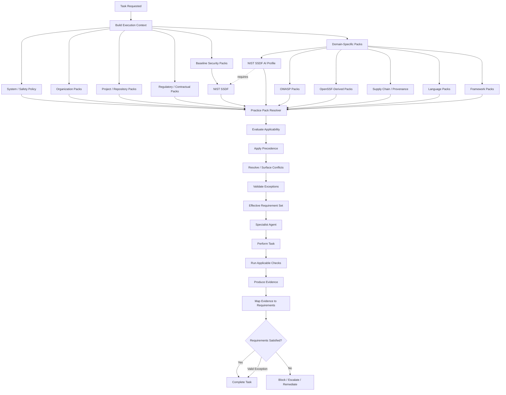

# 03 — Standards Practice Packs

## Purpose

This document defines a modular **Practice Pack** system for an autonomous AI coding harness.

Standards, frameworks, secure-development guidance, regulatory requirements, language guidance, and organization policies are **not normally modeled as independent coding agents**. They are represented as versioned policy and guidance modules that specialist agents consume while performing their assigned work.

The core execution model is:

```text
Specialist Agent
      ↓
determines task/repository context
      ↓
loads applicable Practice Packs
      ↓
derives requirements + checks
      ↓
resolves precedence/conflicts
      ↓
performs task
      ↓
produces evidence
      ↓
maps evidence back to requirements
```

This architecture separates:

* **who performs work** — specialist agents;
* **what rules apply** — Practice Packs;
* **how compliance is demonstrated** — evidence;
* **who may override or except a rule** — the policy and exception system.

NIST SP 800-218 describes the SSDF as a set of high-level secure software development practices intended to be integrated into existing SDLC implementations. It focuses on outcomes rather than prescribing particular tools or mechanisms and explicitly calls for a risk-based determination of applicable practices.  

The Practice Pack architecture preserves that distinction: a source framework may define desired practices or outcomes, while a Practice Pack may additionally contain locally defined checks, evidence rules, and enforcement behavior needed by the harness.

---

# Architecture

The architecture has four primary layers:

```text
┌───────────────────────────────────────────────┐
│ System / Harness Safety Policy                │
│ Non-overridable execution constraints         │
└──────────────────────┬────────────────────────┘
                       │
┌──────────────────────▼────────────────────────┐
│ Practice Pack Resolver                        │
│                                               │
│ • discovers applicable packs                  │
│ • validates versions                          │
│ • evaluates applicability                     │
│ • resolves dependencies                       │
│ • applies precedence                          │
│ • detects conflicts                           │
│ • validates exceptions                        │
│ • emits Effective Requirement Set             │
└──────────────────────┬────────────────────────┘
                       │
┌──────────────────────▼────────────────────────┐
│ Specialist Agents                             │
│                                               │
│ Dependency & Model Vetting                    │
│ Secure Coding                                 │
│ Build Security                                │
│ Security Testing                              │
│ AI Adversarial Testing                        │
│ Release / Provenance                          │
│ etc.                                          │
└──────────────────────┬────────────────────────┘
                       │
┌──────────────────────▼────────────────────────┐
│ Evidence Store                                │
│                                               │
│ requirement → check → result → artifact       │
└───────────────────────────────────────────────┘
```

A Practice Pack is therefore **data and policy**, not an autonomous worker.

A specialist agent may consume several packs simultaneously:

```text
Secure Coding Agent
├── nist-ssdf
├── owasp/application-security
├── language/python
├── organization/acme-secure-coding
└── project/repository-policy
```

or:

```text
AI Adversarial Testing Agent
├── nist-ssdf
├── nist-ssdf-ai
├── owasp/llm
├── organization/ai-security
└── project/repository-policy
```

Practice Packs may depend on other Practice Packs. In particular, the NIST SP 800-218A AI Community Profile is intended to supplement SSDF 1.1 and be used **in conjunction with**, not independently of, SP 800-218.  

---

# What Is a Practice Pack

A **Practice Pack** is a versioned, machine-readable collection of requirements, recommendations, checks, prohibitions, applicability conditions, mappings, and evidence expectations derived from one or more identified authorities.

Examples include:

* a NIST SSDF 1.1 pack;
* a NIST SP 800-218A AI profile pack;
* an OpenSSF-derived dependency-security pack;
* an OWASP application-security pack;
* an OWASP LLM/AI application-security pack;
* a supply-chain provenance pack;
* a Python secure-coding pack;
* an organization secure-development policy;
* a repository-specific policy overlay;
* a regulatory obligation pack.

A pack may contain four fundamentally different kinds of statements. They **MUST NOT be conflated**:

| Statement kind                  | Meaning                                                                                                                                 |
| ------------------------------- | --------------------------------------------------------------------------------------------------------------------------------------- |
| `normative_requirement`         | A requirement imposed by the cited authority, such as applicable law, regulation, contract, or explicitly mandatory organization policy |
| `source_recommendation`         | Guidance or a recommended practice expressed by the source                                                                              |
| `implementation_recommendation` | A suggested way to implement a requirement or practice                                                                                  |
| `example`                       | A non-exclusive example of an implementation, test, artifact, or control                                                                |
| `harness_policy`                | A locally defined rule created by the autonomous coding harness or its operator                                                         |

For NIST SSDF specifically, the distinction between tasks and examples must be retained. NIST describes each practice using a practice, tasks, **Notional Implementation Examples**, and references, and explicitly states that no implementation example or combination of examples is required merely because it appears in the SSDF. 

A Practice Pack compiler MUST therefore preserve source semantics instead of converting every sentence from a framework into a mandatory harness rule.

---

# What Is NOT a Practice Pack

The following are not Practice Packs:

* a coding agent;
* a security-review agent;
* a build agent;
* a vulnerability scanner;
* a dependency resolver;
* an SBOM generator;
* an adversarial test runner;
* a CI workflow;
* an exception approval service;
* an evidence repository;
* a generic prompt containing security advice;
* an unversioned copy of a standards document.

A standard should not become a standalone autonomous agent merely because it contains many requirements.

For example, these are undesirable abstractions:

```text
NIST Agent
OWASP Agent
OpenSSF Agent
SLSA Agent
```

when the actual responsibility belongs to domain specialists.

Prefer:

```text
Dependency & Model Vetting Agent
    + NIST SSDF pack
    + dependency-security pack
    + organization policy

Build Security Agent
    + NIST SSDF pack
    + supply-chain/provenance pack
    + organization build policy
```

An agent is responsible for **action**.

A Practice Pack is responsible for **constraints and guidance**.

---

# Directory Structure

Recommended structure:

```text
standards/
├── README.md
│
├── schemas/
│   ├── practice-pack.schema.json
│   ├── exception.schema.json
│   ├── evidence.schema.json
│   └── pack-lock.schema.json
│
├── registry.yaml
├── pack-lock.yaml
│
├── baseline/
│   └── nist-ssdf/
│       └── 1.1/
│           ├── pack.yaml
│           ├── mappings.yaml
│           └── references.yaml
│
├── ai/
│   └── nist-ssdf-ai/
│       └── 2024-07/
│           ├── pack.yaml
│           ├── mappings.yaml
│           └── references.yaml
│
├── application-security/
│   ├── owasp/
│   │   └── <pinned-source-version>/
│   │       └── pack.yaml
│   └── owasp-llm/
│       └── <pinned-source-version>/
│           └── pack.yaml
│
├── ecosystem/
│   └── openssf/
│       └── <pinned-source-version>/
│           └── pack.yaml
│
├── supply-chain/
│   └── provenance/
│       └── <pack-version>/
│           └── pack.yaml
│
├── language/
│   ├── python/
│   │   └── <version>/
│   │       └── pack.yaml
│   ├── javascript-typescript/
│   │   └── <version>/
│   │       └── pack.yaml
│   ├── java/
│   ├── go/
│   ├── rust/
│   └── c-cpp/
│
├── framework/
│   ├── django/
│   ├── react/
│   ├── spring/
│   └── <framework>/
│
├── regulatory/
│   └── <jurisdiction-or-regime>/
│       └── <version>/
│           └── pack.yaml
│
├── organization/
│   └── <organization-id>/
│       ├── secure-development/
│       ├── dependency-policy/
│       ├── ai-policy/
│       └── build-policy/
│
├── project/
│   └── <repository-or-project-id>/
│       └── pack.yaml
│
├── exceptions/
│   ├── organization/
│   └── project/
│
└── deprecated/
    └── ...
```

The directory path is organizational. The authoritative identity of a pack is always its declared:

```yaml
id:
version:
digest:
```

A repository SHOULD pin the exact set of packs it consumed:

```text
standards/pack-lock.yaml
```

The lock file SHOULD record at minimum:

```yaml
packs:
  - id: nist-ssdf
    version: "1.1"
    digest: "sha256:..."

  - id: organization.secure-development
    version: "7.3.0"
    digest: "sha256:..."
```

---

# Practice Pack Schema

A common Practice Pack schema SHOULD contain at least the following fields.

```yaml
schema_version:
id:
name:
version:

source:
scope:
applies_when:
priority:

requires:
conflicts_with:

requirements:
recommended_checks:
prohibited_patterns:
evidence_required:

agent_mappings:

exceptions:
deprecation:

references:

metadata:
```

## Required top-level fields

### `id`

Stable machine identifier.

Examples:

```yaml
id: nist-ssdf
id: nist-ssdf-ai
id: organization.acme.dependency-policy
id: language.python.secure-coding
```

An `id` MUST NOT contain a version.

---

### `name`

Human-readable pack name.

---

### `version`

Version of the **Practice Pack**, not necessarily the same as the upstream source version.

The upstream version MUST also be recorded under `source`.

---

### `source`

Describes provenance.

Example:

```yaml
source:
  publisher: NIST
  title: Secure Software Development Framework (SSDF) Version 1.1
  identifier: NIST-SP-800-218
  source_version: "1.1"
  publication_date: "2022-02"
  source_kind: guidance
  uri: "https://doi.org/10.6028/NIST.SP.800-218"
  retrieved_at: "..."
  digest: "sha256:..."
```

For composite packs:

```yaml
source:
  source_kind: composite
  inputs:
    - ...
    - ...
```

A composite pack MUST retain source attribution at the individual requirement level.

---

### `scope`

Declares intended coverage.

Example:

```yaml
scope:
  lifecycle:
    - development
    - build
  artifact_types:
    - source_code
    - dependencies
  ecosystems:
    - any
```

---

### `applies_when`

Machine-readable predicates.

Example:

```yaml
applies_when:
  all:
    - repository.contains_source_code: true
  any:
    - task.type: code_change
    - task.type: security_review
```

Selectors SHOULD be declarative and deterministic.

---

### `priority`

Defines the pack's policy authority class.

Recommended values:

```yaml
priority:
  class: baseline_security
```

Allowed classes:

```text
system_safety
organization_mandatory
project_mandatory
regulatory_mandatory
baseline_security
optional_recommendation
```

This field represents **harness precedence**, not a priority value copied from the upstream source.

For example, NIST SP 800-218A defines High, Medium, and Low suggested relative importance for AI-profile tasks. Those source priorities should be retained separately and must not be confused with the harness precedence classes above. 

---

### `requirements`

Each requirement SHOULD be independently addressable.

```yaml
requirements:
  - id:
    title:
    statement_kind:
    source_locator:
    source_semantics:
    strength:
    effective_strength:
    applies_when:
    requirement:
    rationale:
    checks:
    evidence:
    exceptions:
    references:
```

Recommended `statement_kind` values:

```text
normative_requirement
source_recommendation
implementation_recommendation
example
harness_policy
```

---

### `strength`

The harness uses:

```text
MUST
SHOULD
MAY
```

Meanings:

**MUST**

A condition is required for the current operation unless a valid exception exists and the requirement is exception-eligible.

Failure normally blocks the relevant action or causes an explicit non-compliant result.

**SHOULD**

The condition is expected unless there is a documented reason not to follow it.

Deviation MUST be surfaced, not silently ignored.

**MAY**

The condition is optional.

Agents may use it when useful and applicable.

`strength` MUST NOT be represented as though it were the upstream source's normative language unless the source actually uses or establishes that semantics.

Where a source recommendation is promoted locally:

```yaml
source_semantics: recommendation
strength: MUST
strength_origin:
  kind: organization_policy
  policy_id: organization.secure-development
```

This means:

> the organization made the source recommendation mandatory

not:

> the original framework itself said MUST.

---

### `recommended_checks`

Checks that can help determine whether requirements are satisfied.

Example:

```yaml
recommended_checks:
  - id: dependency-known-vulnerability-check
    implementation_kind: scanner
    statement_kind: implementation_recommendation
```

Checks MUST indicate whether they are:

* directly required by the source;
* a source implementation example;
* an organization-defined implementation;
* a harness-generated implementation recommendation.

---

### `prohibited_patterns`

Explicitly prohibited states or actions.

Example structure:

```yaml
prohibited_patterns:
  - id:
    description:
    strength: MUST
    statement_kind: organization_policy
    applies_when:
    detector:
```

A prohibited pattern SHOULD be machine-testable when practical.

---

### `evidence_required`

Defines evidence expected from executing agents.

```yaml
evidence_required:
  - evidence_type: test_result
    requirement_ids:
      - ...
    required_for:
      - completion
```

Evidence requirements must distinguish:

1. evidence explicitly required by an authority;
2. evidence suggested by a source;
3. evidence required only by the harness.

---

### `agent_mappings`

Indicates which agent capabilities commonly consume a pack.

```yaml
agent_mappings:
  primary:
    - secure-coding
  secondary:
    - security-review
```

These mappings are hints.

They MUST NOT be the only applicability mechanism.

---

### `exceptions`

Defines whether and how requirements may be excepted.

---

### `references`

Source-level references and crosswalks.

A cross-reference does not automatically create a second requirement.

---

# Loading Algorithm

The resolver MUST produce a deterministic **Effective Requirement Set** before a specialist agent begins security-sensitive work.

## Phase 1 — Build execution context

Collect:

```text
task type
repository identity
organization
languages
frameworks
package ecosystems
build systems
deployment targets
AI/model involvement
data/model provenance context
jurisdictions
regulatory classifications
contractual requirements
artifact types
risk classification
agent capability
```

Unknown values MUST remain `unknown`; they MUST NOT silently become `false`.

---

## Phase 2 — Load non-overridable system policy

Load:

```text
system/safety requirements
harness invariants
execution sandbox rules
```

These are outside normal repository override control.

---

## Phase 3 — Load organization policy

Load all organization packs whose applicability conditions match.

Mandatory organization policy is loaded before project overlays so that a repository cannot silently remove it.

---

## Phase 4 — Load repository/project policy

Search for repository-declared policy, for example:

```text
.security/practice-packs.yaml
standards/project/pack.yaml
.security-policy.yaml
```

Repository packs may:

* add requirements;
* make baseline recommendations stricter;
* specify implementation mechanisms;
* select language/framework packs;
* disable optional recommendations where permitted;
* request exceptions.

They MUST NOT silently weaken stronger requirements.

---

## Phase 5 — Load applicable regulatory, legal, and contractual packs

Selection must be based on explicit project metadata or authoritative organization configuration.

The harness MUST NOT infer legal jurisdiction or regulatory status from repository names alone.

---

## Phase 6 — Load baseline secure-development packs

Normally:

```text
nist-ssdf
baseline organization secure-development pack
```

SSDF applicability itself is risk based. NIST states that not every practice applies to every use case and that risk, cost, feasibility, and applicability should be considered rather than treating the SSDF as a simple checklist. 

---

## Phase 7 — Load domain-specific packs

Examples:

```text
AI model development
    → nist-ssdf-ai

Python detected
    → language.python.secure-coding

Django detected
    → framework.django

third-party dependency change
    → dependency-security / OpenSSF-derived pack

build/release workflow modification
    → supply-chain.provenance
```

---

## Phase 8 — Resolve pack dependencies

Example:

```yaml
requires:
  - id: nist-ssdf
    version: ">=1.1 <2"
```

`nist-ssdf-ai` MUST cause the baseline SSDF pack to load because SP 800-218A is explicitly intended to supplement SSDF 1.1 rather than stand alone. 

Cycles are invalid.

---

## Phase 9 — Pin and verify versions

For every pack:

```text
resolve version
verify source metadata
verify digest/signature if configured
apply lock file
reject unexpected mutable version
```

Security-sensitive runs SHOULD fail closed if an exact mandatory pack version cannot be resolved.

---

## Phase 10 — Evaluate individual requirement applicability

A loaded pack does not imply every contained requirement applies.

Evaluate each requirement against the complete execution context.

---

## Phase 11 — Resolve precedence and conflicts

Produce a single effective rule set.

No lower-priority rule may silently erase a higher-priority requirement.

---

## Phase 12 — Emit agent policy bundle

The specialist agent receives:

```yaml
effective_policy:
  pack_instances:
  requirements:
  prohibitions:
  recommended_checks:
  accepted_exceptions:
  required_evidence:
  unresolved_conflicts:
```

The bundle MUST include pack IDs, versions, and digests.

---

## Phase 13 — Require evidence

The agent executes the task and emits evidence referencing stable requirement IDs.

Completion is evaluated against the Effective Requirement Set, not against whichever checks the agent happened to run.

---

# Applicability Rules

Applicability must be explicit, reproducible, and explainable.

## Repository applicability

Selectors may use:

```text
repository ID
repository classification
directory
artifact type
service type
risk tier
public/private distribution
```

---

## Task applicability

Examples:

```yaml
task.type:
  - dependency_update
  - code_change
  - build_change
  - model_import
  - release
  - security_test
```

An agent SHOULD load only requirements relevant to the task, while preserving any organization-wide invariant that always applies.

---

## Language-specific applicability

Language packs SHOULD be selected from authoritative repository evidence such as:

```text
source-file extensions
manifest files
lock files
compiler configuration
build configuration
repository metadata
```

Example:

```text
pyproject.toml / requirements files / .py
    → Python pack

Cargo.toml / .rs
    → Rust pack

go.mod / .go
    → Go pack
```

Polyglot repositories load multiple packs.

A language pack MUST NOT displace baseline secure-development requirements.

NIST SSDF itself intentionally remains broadly applicable across programming languages, platforms, and development environments. 

---

## Framework-specific applicability

Framework packs are overlays.

Example:

```text
Python
├── language.python
└── framework.django
```

Framework detection SHOULD require positive evidence.

Do not load a React pack merely because a repository contains JavaScript.

---

## AI-specific applicability

Load AI-specific packs when work includes one or more of:

```text
AI model acquisition
model development
training
fine-tuning
alignment
evaluation
training/test data handling
model weight handling
model integration
model-related development pipelines
```

NIST SP 800-218A scopes its profile to data sourcing, model design, training, fine-tuning, evaluation, and integration of AI models into software. Deployment and operation of AI systems are outside that Profile's scope. 

Therefore:

```text
AI model development
    → nist-ssdf + nist-ssdf-ai

ordinary application merely calling a hosted AI API
    → evaluate applicability;
      do not automatically claim all model-development tasks apply
```

The AI pack resolver MUST differentiate at least:

```text
ai_model_producer
ai_system_producer
ai_system_acquirer
```

because SP 800-218A expressly recognizes those different roles. 

---

## Dependency-specific applicability

Dependency/security packs SHOULD load when a task:

* introduces a dependency;
* updates a dependency;
* changes a dependency source;
* modifies a lock file;
* imports a model or model component;
* adds a reusable third-party component;
* modifies dependency validation policy.

NIST SSDF PW.4.4 calls for verifying that acquired commercial, open-source, and other third-party software components comply with organization-defined requirements throughout their life cycles. Its notional examples include known-vulnerability checks, maintenance/EOL review, and integrity confirmation. 

---

# Precedence Rules

The default precedence is:

```text
system / safety requirements
        >
explicit organization mandatory policy
        >
project / repository mandatory policy
        >
applicable regulatory / contractual security requirements
        >
baseline secure-development practices
        >
optional recommendations
```

This is a **resolution order**, not permission for a higher layer to violate a binding legal obligation.

A second invariant applies:

> A policy layer may strengthen an applicable security requirement, but a lower-authority rule may never silently weaken a stronger applicable requirement.

Applicable legal or regulatory obligations remain hard constraints even when another policy layer has a higher resolution rank. A repository policy may impose a stronger rule than the legal minimum; it may not make the legal obligation disappear.

## Effective strength

When multiple rules address the same condition:

```text
MUST > SHOULD > MAY
```

unless the rules are substantively incompatible.

Example:

```text
Baseline:
  SHOULD verify X

Organization:
  MUST verify X
```

Result:

```text
MUST verify X
```

Example:

```text
Organization:
  MUST prohibit X

Repository:
  MAY allow X
```

Result:

```text
MUST prohibit X
```

The repository rule is shadowed and a conflict diagnostic is emitted.

---

# Conflict Resolution

Conflicts are resolved semantically, not merely by comparing IDs.

## Conflict categories

### Strength conflict

Same intended control, different strengths:

```text
SHOULD A
MUST A
```

Resolve to `MUST A`.

---

### Restrictiveness conflict

Example:

```text
Pack A: dependency version must be pinned
Pack B: dependency ranges are allowed
```

If A has stronger applicable authority, A wins.

---

### Mutually exclusive requirements

Example:

```text
MUST use mechanism A
MUST NOT use mechanism A
```

If both are equally authoritative and applicable, the harness MUST stop and surface an unresolved conflict.

It MUST NOT choose arbitrarily.

---

### Implementation conflict

Example:

```text
Requirement:
  MUST establish artifact integrity

Recommendation A:
  use mechanism X

Recommendation B:
  use mechanism Y
```

If X and Y are merely implementation recommendations and both satisfy the requirement, there is no policy conflict.

The agent may select the appropriate implementation.

---

### Source recommendation versus local mandatory policy

Example:

```text
Source:
  SHOULD perform control X

Organization:
  MUST perform control X
```

The effective rule is `MUST`, but evidence must show that mandatory status comes from the organization policy.

Do not rewrite the source record as though the source itself used mandatory language.

---

## Conflict output

A resolver SHOULD emit:

```yaml
conflict:
  id: conflict-...
  subjects:
    - pack:
      requirement:
    - pack:
      requirement:
  type:
  resolution:
  winning_requirement:
  shadowed_requirement:
  explanation:
```

Every automatic resolution MUST be explainable.

---

# Agent-to-Pack Mapping

| Specialist agent                     | Normal packs                                                                                                     |
| ------------------------------------ | ---------------------------------------------------------------------------------------------------------------- |
| Dependency & Model Vetting Agent     | NIST SSDF, OpenSSF-derived dependency guidance, AI pack when models are involved, organization dependency policy |
| Secure Coding Agent                  | NIST SSDF, OWASP application-security pack, language pack, framework pack, organization secure-coding policy     |
| Build Security Agent                 | NIST SSDF, supply-chain/provenance pack, OpenSSF-derived build guidance, organization build policy               |
| Security Testing Agent               | NIST SSDF, OWASP pack, language/framework-specific testing guidance, project policy                              |
| AI Adversarial Testing Agent         | NIST SSDF, NIST SP 800-218A, OWASP LLM/AI guidance, organization AI policy                                       |
| Release Security Agent               | NIST SSDF, supply-chain/provenance pack, organization release policy                                             |
| Vulnerability Response Agent         | NIST SSDF, organization vulnerability-response policy                                                            |
| Architecture / Threat Modeling Agent | NIST SSDF, relevant application/AI guidance, organization architecture policy                                    |

Mappings are many-to-many.

Agents MUST NOT hard-code the contents of a standard into their prompts when the same rule belongs in a Practice Pack.

---

# NIST SSDF Pack

Recommended ID:

```yaml
id: nist-ssdf
```

Baseline source:

```text
NIST SP 800-218
Secure Software Development Framework (SSDF) Version 1.1
```

The source organizes SSDF practices into:

```text
PO — Prepare the Organization
PS — Protect the Software
PW — Produce Well-Secured Software
RV — Respond to Vulnerabilities
```


The pack SHOULD preserve official practice and task identifiers rather than inventing replacements.

Examples include:

```text
PO.1.1
PO.3.3
PS.2.1
PW.4.4
PW.5.1
PW.7.1
...
```

### Pack design

```yaml
id: nist-ssdf
version: "1.1+harness.1"

source:
  identifier: NIST-SP-800-218
  source_version: "1.1"

priority:
  class: baseline_security
```

The pack SHOULD preserve:

```text
Practice ID
Task ID
Practice wording
Task wording
Notional Implementation Example status
References
```

It MUST NOT promote a Notional Implementation Example into a source-attributed requirement.

For example, SSDF PO.3.3 calls for configuring tools to generate artifacts supporting secure software development practices as defined by the organization. NIST's accompanying examples include using workflow or issue-tracking tooling to create an audit trail and defining artifact security and retention processes. 

This makes PO.3.3 particularly useful as a foundation for the harness evidence architecture, but the exact evidence formats used by this harness remain locally defined unless a separate authority requires them.

Similarly:

* PS.2.1 concerns making software integrity-verification information available to acquirers. 
* PW.5.1 directs implementers to use secure coding practices appropriate to the development languages and environment and to organization requirements. 
* PW.7.1 addresses determining when code review and/or code analysis should be used as defined by the organization. 

These identifiers can be mapped to specialist agents without turning NIST itself into an agent.

---

# NIST AI SSDF Pack

Recommended ID:

```yaml
id: nist-ssdf-ai
```

Source:

```text
NIST SP 800-218A
Secure Software Development Practices for Generative AI and Dual-Use Foundation Models
An SSDF Community Profile
July 2024
```

The publication augments SSDF 1.1 with AI-specific practices, tasks, recommendations, considerations, notes, and informative references. 

Its pack MUST declare:

```yaml
requires:
  - id: nist-ssdf
    version: "1.1"
```

or an explicitly tested compatible successor mapping.

## Preserve source semantics

SP 800-218A uses:

```text
R — recommendation
C — consideration
N — note
```

and forms identifiers such as:

```text
PO.1.2.R1
```

These semantics SHOULD be represented directly rather than normalized into anonymous rules. 

The profile also marks practices/tasks where they are:

```text
Modified from SSDF 1.1
Not part of SSDF 1.1
```

Those annotations MUST be preserved. 

## AI source priority

The Profile assigns High, Medium, or Low suggested relative importance to tasks. That source-level priority should be stored separately:

```yaml
source_priority: high
```

It does **not** replace harness precedence.

## AI provenance example

SP 800-218A adds PW.3.2:

> Track provenance, when known, for training, testing, fine-tuning, and aligning data, and document data whose provenance is unknown.

The Profile notes that provenance cannot always be verified but that tracking known and unknown provenance remains useful. 

This can be mapped to:

```text
Dependency & Model Vetting Agent
AI Data Vetting Agent
AI Adversarial Testing Agent
```

without creating a separate "NIST AI agent."

## AI evidence

The Profile's AI-specific treatment of PO.3.3 describes artifacts as records supporting secure development practices and gives attestations of integrity and provenance of training datasets as AI-specific examples. 

A harness may therefore use provenance attestations as evidence, while clearly marking any exact file format, schema, signing mechanism, or retention period as locally defined unless another source requires it.

---

# OpenSSF Pack

Recommended namespace:

```text
ecosystem/openssf/
```

Possible IDs:

```text
openssf.dependency-security
openssf.build-security
openssf.project-security
```

The pack's role is to provide ecosystem and open-source software security guidance relevant to specialist agents such as:

```text
Dependency & Model Vetting Agent
Build Security Agent
Repository Security Agent
```

No OpenSSF source document was supplied with this design. Therefore this document does **not** invent or reproduce OpenSSF requirements.

The actual OpenSSF pack MUST:

1. identify the exact OpenSSF source;
2. pin a source version, revision, or immutable digest;
3. preserve source identifiers where provided;
4. distinguish requirements from recommendations and examples;
5. record mappings to other packs as informative crosswalks;
6. avoid turning descriptive project guidance into mandatory rules unless an organization policy explicitly promotes it.

Example structure:

```yaml
id: openssf.dependency-security

source:
  publisher: OpenSSF
  title: "<exact source title>"
  source_version: "<pinned version>"
  digest: "sha256:..."

requirements:
  # populated only from validated source material
```

---

# OWASP Pack

Recommended namespaces:

```text
application-security/owasp/
application-security/owasp-llm/
```

General application security and AI/LLM guidance SHOULD be separate packs so they can be selected independently.

Example IDs:

```text
owasp.application-security
owasp.llm-security
```

The normal mapping is:

```text
Secure Coding Agent
    → OWASP application-security

Security Testing Agent
    → OWASP application-security

AI Adversarial Testing Agent
    → OWASP LLM/AI application guidance
```

No standalone OWASP source document was supplied for this design, so exact OWASP control text is intentionally not reproduced here.

The NIST SP 800-218A source does, however, use OWASP Top 10 for LLM Applications Version 1.1 identifiers as **Informative References** within its AI Community Profile. NIST explains that these mappings point to vulnerability types and potentially individual prevention or mitigation strategies. 

Such a mapping:

```text
NIST task → OWASP identifier
```

MUST NOT automatically be interpreted as:

```text
NIST requires every OWASP mitigation
```

The OWASP pack must independently encode what its own pinned source actually says.

---

# Supply Chain / Provenance Pack

Recommended ID:

```yaml
id: supply-chain.provenance
```

This pack is intended for:

```text
Build Security Agent
Dependency & Model Vetting Agent
Release Security Agent
Artifact Publication Agent
```

It may combine requirements from several authoritative sources, but every item must retain its provenance.

Typical subjects include:

```text
source provenance
dependency provenance
model provenance
build inputs
build outputs
artifact integrity
release integrity
build metadata
attestations
dependency lifecycle
third-party component validation
```

These subjects are supported at a high level by the supplied NIST sources. For example, SSDF PW.4.4 addresses verification of third-party software against organization-defined requirements over its lifecycle, while PS.2.1 addresses release-integrity verification information.  

For AI development, SP 800-218A additionally recognizes challenges in model versioning and lineage and calls for documenting artifacts that cannot be fully covered by secure-development practices. 

A SLSA-style implementation may be incorporated here, but exact SLSA requirements MUST come from a pinned SLSA source.

The pack SHOULD distinguish:

```yaml
- statement_kind: normative_requirement
  source: "<actual authority>"

- statement_kind: source_recommendation
  source: "<actual framework>"

- statement_kind: harness_policy
  requirement: "The harness MUST store evidence objects using ... "
```

A local requirement inspired by several standards MUST be labeled `harness_policy`; references may explain its rationale without falsely attributing the exact requirement to those standards.

---

# Language-Specific Packs

Language packs translate general secure-development goals into checks appropriate to a programming language and toolchain.

Examples:

```text
language.python.secure-coding
language.rust.secure-coding
language.go.secure-coding
language.java.secure-coding
language.c-cpp.secure-coding
language.javascript-typescript.secure-coding
```

They SHOULD cover language-specific concerns only where supported by authoritative or organization-approved sources.

Possible content categories include:

```text
dangerous APIs
memory-safety considerations
deserialization behavior
command execution
input/output handling
cryptographic API use
dependency tooling
compiler/interpreter security options
package ecosystem behavior
language-specific static analysis
```

The pack must not invent a rule merely because the harness believes it is "best practice."

Locally invented rules are permitted, but they must be labeled:

```yaml
statement_kind: harness_policy
```

or:

```yaml
statement_kind: organization_policy
```

as appropriate.

The resolver SHOULD select language packs dynamically from repository evidence.

---

# Organization Policy Pack

Organization policy is the primary mechanism for converting broad external recommendations into enforceable development requirements.

Example:

```yaml
id: organization.acme.secure-development
version: "7.3.0"

priority:
  class: organization_mandatory
```

Organization policy may say:

```text
NIST recommendation X is mandatory for Tier-1 services.
```

The resulting rule should retain both layers:

```yaml
source_basis:
  pack: nist-ssdf
  requirement: PW.x.y

statement_kind: normative_requirement
authority:
  type: organization_policy

strength: MUST
```

Do not mutate the NIST pack to claim that NIST itself imposed the organization-specific requirement.

Organization packs may define:

```text
mandatory pack selections
approved tools
minimum test suites
prohibited dependencies
required evidence
risk thresholds
approval requirements
AI model acquisition rules
release gates
exception authorities
```

Organization policy cannot override system/safety constraints.

It also cannot legally waive an external legal or regulatory obligation merely by assigning itself higher precedence.

---

# Custom Project Packs

Repositories may define local overlays.

Recommended location:

```text
standards/project/<repository-id>/pack.yaml
```

or:

```text
.security/practice-pack.yaml
```

Project packs may:

* strengthen inherited requirements;
* add project-specific checks;
* declare architecture-specific applicability;
* choose among allowed implementation recommendations;
* add evidence requirements;
* document accepted risks;
* request explicit exceptions;
* disable `MAY` recommendations;
* narrow irrelevant baseline tasks where the parent pack explicitly permits applicability filtering.

Project packs MUST NOT:

* silently lower an inherited `MUST`;
* turn a prohibition into permission;
* disable system/safety policy;
* falsify the semantics of an upstream standard;
* claim an external standard says something it does not;
* self-approve an exception when organization policy requires external approval.

Example:

```yaml
overrides:
  - target: nist-ssdf:PW.7.1
    action: strengthen
    effective_strength: MUST
    reason: "Repository classified as critical"
```

Invalid:

```yaml
overrides:
  - target: organization.acme:DEP-001
    action: change_strength
    from: MUST
    to: MAY
```

unless the organization policy explicitly delegates that authority.

---

# Exceptions

Exceptions are first-class, explicit, scoped objects.

They MUST NOT be implemented by deleting, commenting out, or shadowing a requirement.

Example:

```yaml
exception:
  id: EXC-2026-0042

  requirement:
    pack: organization.acme.dependency-policy
    id: DEP-017

  scope:
    repository: service-a
    component: package-x
    versions:
      - "4.2.1"

  rationale: "..."

  compensating_controls:
    - "..."

  risk:
    owner: "..."
    rating: high

  approval:
    authority: security-architecture
    approved_by: "..."
    approved_at: "..."

  valid_from: "..."
  expires_at: "..."

  evidence:
    - "..."

  status: active
```

## Exception rules

An exception MUST include:

```text
requirement identity
scope
reason
approving authority
approval evidence
expiration or explicit review date
```

For higher-risk exceptions, it SHOULD additionally include:

```text
compensating controls
risk owner
residual risk
monitoring conditions
```

Exceptions MUST be:

* narrow;
* time bounded unless policy explicitly permits otherwise;
* reviewable;
* auditable;
* tied to a specific requirement.

Expired exceptions are invalid.

A requirement may declare:

```yaml
exceptions:
  allowed: false
```

Lower-authority actors cannot create an exception to a higher-authority requirement unless the higher authority explicitly delegates that ability.

Legal/regulatory obligations are not assumed to be waiverable. Any exception must be based on an actual legally valid exception or authorization.

---

# Versioning

Practice Packs MUST be versioned independently from their source documents.

Example:

```text
Upstream:
  NIST SSDF 1.1

Pack:
  nist-ssdf 1.1+harness.3
```

The distinction allows:

```text
mapping fixes
metadata fixes
selector fixes
evidence-schema changes
```

without falsely claiming the upstream standard changed.

## Pack version classes

Recommended semantic model:

```text
MAJOR
    effective requirements or compatibility change materially

MINOR
    new compatible mappings/checks/evidence capabilities

PATCH
    non-semantic corrections
```

Upstream source versions MUST always remain explicitly recorded.

---

## Immutable releases

A published pack version MUST be immutable.

If content changes:

```text
publish a new pack version
```

Do not alter a released version in place.

---

## Locking

Security-sensitive execution SHOULD resolve through:

```yaml
pack-lock.yaml
```

The lock SHOULD record:

```text
pack ID
pack version
source version
pack digest
source digest where available
dependency graph
```

Evidence MUST record the exact effective pack versions used.

---

# Deprecation

A pack may declare:

```yaml
deprecation:
  status: deprecated
  deprecated_at: "..."
  replacement:
    id: ...
    version: ...
  end_of_support: "..."
  reason: "..."
```

States SHOULD include:

```text
active
deprecated
retired
revoked
```

`revoked` means the pack MUST NOT be used for new evaluations.

A deprecated security pack MUST NOT disappear silently. The loader should emit an explicit diagnostic and, where policy requires, block execution until migration.

---

# Evidence Mapping

Practice Packs must make compliance traceable.

The evidence model is:

```text
source
  ↓
pack requirement
  ↓
effective requirement
  ↓
agent action/check
  ↓
result
  ↓
evidence artifact
```

Every evidence object SHOULD include:

```yaml
evidence:
  id:
  generated_at:
  agent:
  task_id:

  requirement:
    pack_id:
    pack_version:
    requirement_id:
    effective_strength:

  check:
    id:
    implementation:
    version:

  result:
    status:
    summary:

  artifacts:
    - uri:
      digest:
      media_type:

  context:
    repository:
    commit:
    build:
```

## Evidence statuses

Recommended statuses:

```text
pass
fail
not_applicable
exception_applied
indeterminate
not_run
```

`not_applicable` MUST include the applicability decision.

`exception_applied` MUST reference a valid exception ID.

`indeterminate` MUST NOT be treated as `pass`.

---

## Evidence sufficiency

A scanner finding no issue is not automatically proof that a broad security requirement has been satisfied.

Practice Packs SHOULD define the relationship:

```text
requirement
    → one or more admissible checks
    → minimum acceptable evidence
```

Example:

```yaml
evidence_required:
  - requirement_id: PW.4.4
    evidence_policy:
      any_of:
        - component-vetting-record
        - approved-equivalent
```

The exact `component-vetting-record` format in this example would be a **locally defined harness policy** unless an authoritative source imposes that exact format.

NIST SSDF PO.3.3 provides a useful conceptual foundation by calling for tools to generate artifacts of support for secure development practices. 

---

## Cross-pack evidence reuse

One artifact may satisfy several requirements.

Do not duplicate expensive checks solely because multiple packs map to the same underlying security outcome.

Example:

```text
dependency integrity evidence
    ├── NIST-derived requirement
    ├── organization requirement
    └── supply-chain pack requirement
```

The evidence store may associate one artifact with all three, provided the artifact actually satisfies each rule's evidence criteria.

A mapping MUST NOT imply that satisfying one framework automatically proves compliance with another.

---

# Example YAML Practice Pack

The following example demonstrates the schema and source-semantics rules using material present in NIST SP 800-218A.

It is an **illustrative harness representation**, not an official NIST YAML artifact.

```yaml
schema_version: "1.0"

id: nist-ssdf-ai
name: "NIST SSDF Community Profile for AI Model Development"
version: "2024-07+harness.1"

source:
  publisher: "National Institute of Standards and Technology"
  title: "Secure Software Development Practices for Generative AI and Dual-Use Foundation Models"
  identifier: "NIST-SP-800-218A"
  publication_date: "2024-07"
  source_kind: "guidance"
  uri: "https://doi.org/10.6028/NIST.SP.800-218A"
  digest: "<pinned-source-digest>"

scope:
  domains:
    - secure-software-development
    - ai-model-development
  lifecycle:
    - data-sourcing
    - model-design
    - training
    - fine-tuning
    - evaluation
    - model-integration
  explicitly_out_of_scope:
    - ai-system-deployment
    - ai-system-operation

requires:
  - id: nist-ssdf
    version: "1.1"

applies_when:
  any:
    - project.ai_role: ai_model_producer
    - task.uses_ai_model_development_artifacts: true
    - task.type:
        in:
          - model_training
          - model_fine_tuning
          - model_evaluation
          - model_integration

priority:
  class: baseline_security

requirements:

  - id: "PW.3.2"
    title: "Track provenance of AI model development data"
    statement_kind: source_recommendation
    source_semantics: task
    source_status: "Not part of SSDF 1.1"
    source_priority: medium
    source_locator:
      publication: "NIST SP 800-218A"
      table: 1
      task: "PW.3.2"

    strength: SHOULD
    strength_origin:
      kind: harness_mapping_of_source_recommendation

    requirement: >
      Track provenance when known for training, testing,
      fine-tuning, and aligning data, and record when
      provenance is unknown.

    applies_when:
      artifact.type:
        in:
          - training_data
          - testing_data
          - fine_tuning_data
          - alignment_data

    recommended_checks:
      - id: ai-data-provenance-record-present
        statement_kind: implementation_recommendation
        attribution: harness
        description: >
          Check that each in-scope dataset has either
          provenance information or an explicit
          unknown-provenance state.

    evidence:
      - evidence_type: provenance_record
        attribution: harness

    references:
      - source: NIST-SP-800-218A
        locator: "PW.3.2"

recommended_checks:

  - id: ai-provenance-coverage-report
    statement_kind: harness_policy
    description: >
      Produce a machine-readable report showing which
      in-scope AI development artifacts have known,
      partially known, or unknown provenance.

evidence_required:

  - id: ai-provenance-evidence
    statement_kind: harness_policy
    requirement_ids:
      - "PW.3.2"
    accepted:
      - provenance_record
      - signed_dataset_attestation
      - approved_equivalent

agent_mappings:
  primary:
    - dependency-and-model-vetting
    - ai-data-vetting
  secondary:
    - ai-adversarial-testing
    - build-security

exceptions:
  default:
    allowed: true
    approval_required: organization-security
    expiration_required: true

references:
  - id: NIST-SP-800-218
    relation: required_baseline
  - id: NIST-SP-800-218A
    relation: source
```

The source basis for `PW.3.2` above is the AI Community Profile task that addresses known and unknown provenance. 

Notice that the example does **not** claim NIST mandates:

```text
a particular YAML schema
a particular provenance database
a particular signing system
a particular evidence filename
```

Those are harness implementation choices unless another applicable authority makes them mandatory.

---

# Mermaid Diagram



The governing principle is:

```text
Standards describe practices, requirements, recommendations,
considerations, and examples.

Practice Packs preserve and operationalize those statements.

Specialist Agents consume the applicable packs.

The resolver determines precedence and exceptions.

Agents perform the work.

Evidence demonstrates what was actually done.
```

No standard, framework, recommendation, project overlay, or lower-priority pack may silently weaken a stronger applicable security requirement.
