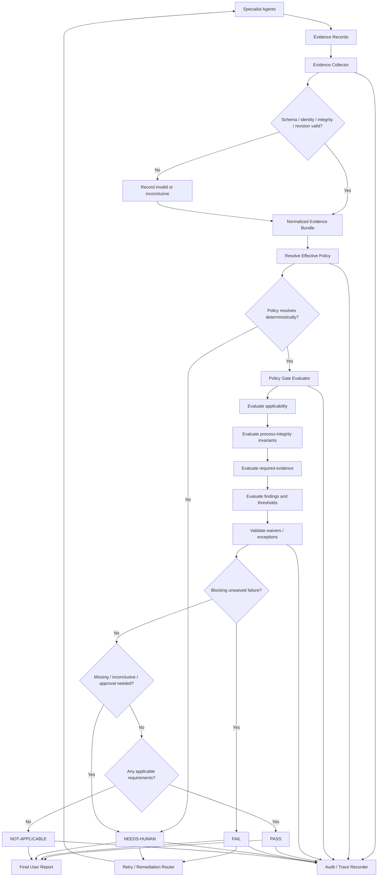

# Purpose

The evidence and policy-gating layer decides whether a proposed code change may proceed based on verifiable, structured evidence rather than agent assertions.

**Core principle:** never trust a specialist agent merely because it says `done`, `secure`, `reviewed`, or `tests passed`.

The harness treats those statements as untrusted claims until they are backed by evidence records that can be validated, bound to the exact change under review, and evaluated against the effective repository/project policy.

The architecture is:

```text
Specialist Agents
      ↓
Evidence Records
      ↓
Evidence Collector
      ↓
Policy / Security Gate
      ↓
PASS / FAIL / NEEDS-HUMAN / NOT-APPLICABLE
```

This layer has four logical components:

1. **Evidence Collector** — ingests, validates, normalizes, deduplicates, and binds evidence to a specific change/revision.
2. **Policy Gate Evaluator** — evaluates normalized evidence against deterministic policy rules and emits a decision. It **must not rewrite code, modify the change, or silently remediate findings**.
3. **Exception / Waiver Handler** — validates explicit risk acceptances and authorized exceptions without erasing the underlying finding.
4. **Audit / Trace Recorder** — records the evidence, policy, decisions, identities, exceptions, retries, and transitions necessary to reconstruct why a release decision was made.

The design is consistent with the SSDF approach of defining security-check criteria, gathering artifacts that support those criteria, recording approvals/rejections/exceptions, preserving integrity/provenance information for releases, reviewing and testing software, and tracking risk responses and approved exceptions. For AI-related work, the evidence model also supports model/data integrity and provenance, adversarial testing, AI-specific security evaluation, and risk-based human review.

The gate is a decision engine, not a coding agent. Its allowed outputs are decisions, reasons, required evidence, remediation routing instructions, and audit events.

# Trust Model

The harness assumes that any individual agent, tool, process, or evidence producer can be wrong, incomplete, stale, compromised, or misconfigured.

Accordingly:

- Natural-language claims are **not** release evidence by themselves.
- Evidence must be structured and attributable to a producer.
- Evidence must be bound to the relevant `change_id` and normally to the exact `revision_id` / commit digest being gated.
- Evidence from automated tools should include tool identity/version, invocation scope, execution status, and machine-readable results where practical.
- Human or agent approvals must identify the approving principal and the revision reviewed.
- Evidence should be integrity-protected when practical through hashes, signatures, attestations, append-only logs, or trusted storage.
- The collector must not convert an `error`, `inconclusive`, or missing result into `pass`.
- The gate evaluator must not infer that an absent finding means a scan passed unless there is positive evidence that the required scan completed successfully for the applicable scope.
- A specialist's self-review may supplement evidence but cannot satisfy an independent-review requirement.
- A waiver changes the **policy treatment** of a finding; it does not change the fact that the finding exists.
- Stale evidence is not automatically reusable after the change changes. Reuse is allowed only when policy explicitly permits it and the evidence scope can be proven unaffected.

The evidence layer distinguishes three identities:

- `agent_id`: a concrete agent/process instance.
- `principal_id`: the accountable identity behind that instance, such as a human, service account, organization-controlled role, or stable autonomous agent identity.
- `role`: the function performed for the gate, such as author, reviewer, security reviewer, test runner, dependency reviewer, build producer, or waiver approver.

Separation-of-duties checks operate primarily on `principal_id`, not display names or transient agent instance IDs.

The following **process-integrity invariants** are harness-level and cannot be weakened by repository policy:

- The gate evaluator cannot modify the gated code/revision.
- Evidence cannot be silently fabricated or rewritten by the collector.
- A gate result must identify the exact policy version and evidence set used.
- A required independent review cannot be satisfied by the author acting as the sole reviewer.
- A waiver cannot approve itself and cannot be accepted from an unauthorized approver.
- `NOT-APPLICABLE` cannot be used as a substitute for missing required evidence.

Security thresholds, required scanners, required test suites, risk-level mappings, minimum reviewer counts, waiverable severities, AI-specific checks, dependency-review rules, and similar controls are configurable by organization/repository/project policy.

# Evidence Collector

The Evidence Collector is the only supported ingestion path from specialist agents into the gate.

Its responsibilities are deterministic and side-effect limited.

## Inputs

The collector accepts evidence from sources such as:

- unit, integration, system, regression, fuzz, penetration, red-team, and adversarial test runners;
- static analysis, dynamic analysis, SCA, malware, configuration, and secrets scanners;
- dependency inventory and dependency-diff agents;
- code-review and design-review agents;
- threat-modeling agents;
- build systems;
- artifact signing and verification systems;
- SBOM/provenance generators;
- source-control metadata;
- identity/attestation services;
- AI model/data provenance and security evaluators;
- authorized human reviewers and approvers.

## Collector pipeline

For each submitted evidence record, the collector executes the following steps in order:

1. **Parse** — the record must conform to the supported schema version.
2. **Authenticate producer** — verify the producer identity/credential if the source supports authentication.
3. **Verify integrity** — verify record hash/signature/attestation when required by policy.
4. **Bind subject** — verify `change_id`, repository, revision/commit, artifact digest, and scope.
5. **Check freshness** — determine whether the record is valid for the current gate attempt and policy-defined age limits.
6. **Validate execution** — distinguish tool execution success from test/security success. A scanner crash is `error`, not `pass`.
7. **Normalize status** — map source-specific states into the normalized status vocabulary.
8. **Normalize findings** — convert findings into the Finding Schema and preserve source-native identifiers in `source_metadata`.
9. **Deduplicate** — merge duplicate observations only when their fingerprints match; preserve all source references.
10. **Index requirements** — associate the record with one or more policy requirement IDs.
11. **Store immutably** — persist the normalized record and its digest.
12. **Emit audit event** — record acceptance, rejection, invalidation, or supersession.

The collector never upgrades evidence. Examples:

- `scanner_error` → `error`, not `pass`.
- `test_not_run` → `missing` at requirement evaluation time, not `not_applicable`.
- `review_comment_only` → not an approval unless the review schema explicitly records approval.
- `agent says secure` → claim metadata only, not security evidence.
- `artifact hash supplied but artifact unavailable` → integrity evidence may be `inconclusive` unless the policy allows hash-only verification.

## Evidence freshness and invalidation

Evidence is invalidated when any policy-defined subject binding changes. By default:

- code/test/security evidence binds to `revision_id`;
- build evidence binds to both `revision_id` and `artifact_hash`;
- review approval binds to `revision_id` and review scope;
- dependency review binds to the dependency manifest/lockfile digest and dependency diff;
- threat-model evidence binds to the design/risk-model version and the revision or change scope it evaluates;
- AI model/data evidence binds to model identifier/version, relevant configuration, data/provenance identifiers, and revision where applicable.

A later revision does not inherit earlier `PASS` evidence unless the effective policy explicitly defines safe evidence reuse. Reuse must record why the changed files/components are outside the evidence scope or why the evidence remains valid.

# Policy Gate

The Policy Gate Evaluator consumes a normalized Evidence Bundle plus the effective policy and emits exactly one terminal result:

- `PASS`
- `FAIL`
- `NEEDS-HUMAN`
- `NOT-APPLICABLE`

The evaluator may also emit non-terminal per-requirement states:

- `SATISFIED`
- `UNSATISFIED`
- `MISSING`
- `INCONCLUSIVE`
- `WAIVED`
- `NOT_APPLICABLE`

The evaluator is pure with respect to the codebase: it reads evidence and policy, computes a result, records it, and returns routing instructions. It must not edit source files, change dependency versions, suppress findings, modify tests, alter scanner configuration, or generate a replacement implementation.

## Policy resolution

The gate evaluates an **effective policy** assembled from policy layers. A recommended precedence is:

```text
Harness process-integrity invariants
        ↓
Organization baseline
        ↓
Repository policy
        ↓
Project/component policy
        ↓
Branch/release policy overlay
```

A child policy may tighten a parent policy freely. A child may weaken a parent rule only when the parent explicitly marks that rule as overridable.

Every resolved rule receives a stable `rule_id`, effective parameters, origin, and policy digest. Conflicting rules that cannot be deterministically resolved produce `NEEDS-HUMAN` unless a higher-precedence rule explicitly defines conflict behavior.

## Rule structure

A policy rule should define at least:

```yaml
rule_id: security.high-findings
applies_when: <deterministic expression>
requirement: <deterministic predicate over normalized evidence>
on_missing: FAIL | NEEDS-HUMAN
on_inconclusive: FAIL | NEEDS-HUMAN
waiver:
  allowed: true | false
  authorized_roles: [security_lead]
  max_duration: 7d
severity: blocking
remediation_route: security-agent
```

Policy expressions must use a constrained, deterministic expression language. They must not depend on free-form LLM judgment at gate-evaluation time. If a classifier or LLM is needed, it runs before the gate and emits structured evidence; the gate then evaluates that evidence according to policy.

# Evidence Schema

The harness uses two related schemas:

1. **Evidence Record** — one producer's structured evidence item.
2. **Evidence Bundle** — the collector's normalized aggregate for one gate attempt.

## Normalized Evidence Record

```yaml
schema_version: "1.0"
record_id: "ev-..."                  # globally unique
record_digest: "sha256:..."          # digest of canonical normalized record
change_id: "chg-..."
repository: "org/repo"
revision_id: "git:..."               # exact revision/commit being evaluated
base_revision_id: "git:..."          # optional but recommended
created_at: "2026-09-05T22:00:00Z"
expires_at: null                       # optional; policy may impose freshness independently

evidence_type: "test_result"          # enum controlled by schema registry
status: "pass"                         # pass|fail|inconclusive|error|not_applicable
scope:
  files: ["src/example.ts"]
  components: ["tool-router"]
  artifacts: []
  environment: "ci/security"

producer:
  agent_id: "security-agent-17"
  principal_id: "svc:security-reviewer"
  role: "security_reviewer"
  implementation: "security-agent/v4.2"

requirements:
  - "REQ-SEC-004"

execution:
  tool: "scanner-name"
  tool_version: "3.9.1"
  invocation_id: "run-..."
  started_at: "2026-09-05T21:55:00Z"
  finished_at: "2026-09-05T21:59:00Z"
  exit_code: 0
  command_fingerprint: "sha256:..."
  environment_fingerprint: "sha256:..."

summary:
  passed: 142
  failed: 0
  skipped: 3

artifacts:
  - kind: "report"
    uri: "evidence://reports/run-..."
    digest: "sha256:..."
    media_type: "application/sarif+json"

findings: []                            # Finding Schema objects or references

provenance:
  source_system: "ci"
  source_run_id: "run-..."
  input_digests:
    - "git:..."
  sbom_digest: null
  attestation_digest: "sha256:..."

attestation:
  signature_status: "verified"         # verified|invalid|missing|not_required
  signer: "keyid:..."
  signature_reference: "attestation://..."

source_metadata: {}                     # source-native data not used directly for policy logic
```

## Normalized Evidence Bundle

The Evidence Bundle is the sole input to the Policy Gate Evaluator.

```yaml
schema_version: "1.0"
bundle_id: "bundle-..."
bundle_digest: "sha256:..."
change_id: "chg-..."
repository: "org/repo"
revision_id: "git:..."
base_revision_id: "git:..."
policy_id: "repo-release-policy"
policy_version: "2026-09-01"
policy_digest: "sha256:..."
gate_attempt: 3
risk_level: "high"                     # low|medium|high|critical, or policy-defined extension
risk_evidence_reference: "ev-risk-..."

author_agent:
  agent_id: "coder-42"
  principal_id: "svc:coding-agent"

reviewer_agents:
  - agent_id: "reviewer-9"
    principal_id: "svc:review-agent"
    role: "code_reviewer"

requirements:
  - id: "REQ-TEST-001"
    required: true
    state: "SATISFIED"
    evidence_references: ["ev-test-..."]

# Convenience indexes over normalized Evidence Records.
tests: ["ev-test-..."]
security_tests: ["ev-sec-..."]
dependency_review: ["ev-dep-..."]
build: ["ev-build-..."]
artifact_integrity: ["ev-integrity-..."]
code_reviews: ["ev-review-..."]
configuration_review: ["ev-config-..."]
secrets_scan: ["ev-secrets-..."]
threat_model: ["ev-threat-..."]
ai_security_evaluation: ["ev-ai-sec-..."]
model_data_provenance: ["ev-ai-prov-..."]

findings:
  - "finding-..."

exceptions:
  - "waiver-..."

records:
  - "ev-risk-..."
  - "ev-test-..."
  - "ev-sec-..."

collection_issues: []

gate_result: null                       # populated only after evaluation
gate_reason_codes: []
```

The schema registry should define controlled values for `evidence_type`, `status`, `role`, and common artifact kinds. Unknown extensions may be retained but cannot satisfy a mandatory requirement unless policy explicitly recognizes them.

# Finding Schema

Every detected issue that may influence a gate is normalized as a Finding.

Required fields are:

```yaml
id: "F-2026-00123"
source: "sast:scanner-name"
severity: "high"                       # informational|low|medium|high|critical, or mapped policy scale
confidence: "high"                     # low|medium|high, or numeric policy-defined scale
component: "tool-router"
description: "Untrusted tool argument reaches privileged execution path."
status: "open"                         # open|remediated|false_positive|accepted|waived|duplicate
remediation: "Validate and constrain tool arguments before privileged dispatch."
evidence_reference: "ev-sec-..."
```

Recommended additional fields:

```yaml
fingerprint: "sha256:..."
category: "injection"
rule_id: "SAST-771"
location:
  path: "src/router.ts"
  start_line: 88
  end_line: 103
introduced_revision: "git:..."
last_observed_revision: "git:..."
owner: "security-agent"
waiver_id: null
related_findings: []
references: []
source_metadata: {}
```

## Finding semantics

- `open` — unresolved and policy-evaluable.
- `remediated` — evidence shows the issue was fixed for the current revision.
- `false_positive` — a qualified review determined the source finding does not represent the reported condition; the supporting adjudication is evidence and may itself require independent approval.
- `accepted` — risk accepted through a valid non-waiver process recognized by policy.
- `waived` — an explicit, valid waiver applies; the finding remains visible.
- `duplicate` — points to a canonical finding and does not independently increase count unless policy says otherwise.

A finding cannot move from `open` to `remediated`, `false_positive`, `accepted`, or `waived` solely because the author agent says so. The transition requires evidence of the appropriate type and authority.

# Required Evidence by Risk Level

Risk level determines the minimum class of evidence required. The following is a **reference profile**, not a universal hard-coded checklist. Repositories may add requirements, tighten thresholds, require additional reviewers, or mark evidence as not applicable based on deterministic scope rules.

| Evidence | Low | Medium | High | Critical |
|---|---|---|---|---|
| Change metadata + author identity | Required | Required | Required | Required |
| Risk classification evidence | Required | Required | Required | Required |
| Required functional/unit tests | Required when affected | Required | Required | Required |
| Build result | If buildable | Required if buildable | Required if buildable | Required if buildable |
| Code review | Policy-dependent | Required | Required | Required |
| Independent reviewer | If review required, author cannot be sole reviewer | Required | Required | Required; recommended multiple reviewers |
| Static/code security analysis | Policy-dependent | Required for code-bearing changes | Required | Required |
| Secrets scan | Policy-dependent | Required for code/config changes | Required | Required |
| Dependency inventory/diff | If manifests changed | Required if dependencies may change | Required | Required |
| New dependency review | If new dependency | Required if new dependency | Required if new dependency | Required if new dependency |
| Security tests | As scoped | As scoped | Required for security-sensitive changes | Required |
| Threat model / risk model | As scoped | As scoped | Required for security-sensitive/design-sensitive changes | Required for security-sensitive/design-sensitive changes |
| Configuration review | If security-relevant configuration changes | If applicable | Required if applicable | Required if applicable |
| SBOM / provenance | Policy-dependent | Policy-dependent | Required for release-producing changes when applicable | Required when applicable |
| Artifact hash | If artifact produced | Required if artifact produced | Required | Required |
| Signature / attestation status | Policy-dependent | Policy-dependent | Required where signing policy applies | Required where signing policy applies |
| Unresolved-finding inventory | Required | Required | Required | Required |
| AI adversarial/security evaluation | Required when AI tool-calling or policy-triggered AI behavior is changed | Same | Same | Same + human review if policy requires |
| Model/data provenance evidence | When model/data is introduced or changed | When applicable | Required when applicable | Required when applicable |
| Human approval | Not normally | Policy-dependent | For configured thresholds/exceptions | Recommended/required by policy for highest-risk release classes |

The gate must evaluate applicability from policy and structured change metadata, not from an agent's unsupported assertion that a check is unnecessary.

Examples of deterministic applicability predicates:

```text
new_dependency == true
security_sensitive == true
changes_paths("infra/**")
changes_paths("**/*.lock")
produces_release_artifact == true
ai_tool_calling_changed == true
model_or_training_data_changed == true
public_api_changed == true
authn_or_authz_changed == true
```

# Required Evidence by Agent

Evidence requirements are also constrained by the role of the producer.

| Agent / Role | May provide | Cannot alone satisfy |
|---|---|---|
| Author / coding agent | Change metadata, implementation notes, self-tests, local reproduction evidence | Independent code review, independent security approval, waiver approval |
| Test agent | Test plan, commands, environment, test results, coverage evidence, regression results | Code-review approval unless separately authorized and independent |
| Security scanner / security agent | SAST/DAST/SCA/secrets/malware results, security tests, threat-model review, finding triage | Author-independent approval if same `principal_id` as author |
| Dependency agent | Dependency inventory, newly introduced dependencies, license/provenance/security review | General code approval unless policy grants that role |
| Reviewer agent | Review scope, revision reviewed, approval/rejection, comments, finding adjudication | Valid independent review when reviewer `principal_id == author principal_id` |
| Build agent | Build result, toolchain versions, build logs, artifact hashes, attestations | Source-code security review |
| Provenance/SBOM agent | SBOM, dependency/model/data provenance, material digests, attestation evidence | Security approval unless policy explicitly says so |
| AI security evaluator | Prompt/tool abuse tests, adversarial tests, red-team results, model/data provenance checks | Human-only approval requirements |
| Waiver approver | Signed/attested exception decision within delegated authority | Approval of own authored change/finding when separation policy forbids it |
| Evidence Collector | Normalization, binding, validation, deduplication | Creating evidence that was never produced |
| Policy Gate Evaluator | Rule evaluation, result, reason codes, remediation routing | Editing code, suppressing findings, manufacturing approvals |
| Audit Recorder | Append-only trace events | Changing gate result or evidence state without a corresponding authorized event |

If one principal performs multiple roles, each evidence item records the role used. Policy decides which role combinations are incompatible.

# Gate Decision Algorithm

The gate algorithm is deterministic for a fixed tuple:

```text
(evidence_bundle_digest, effective_policy_digest, evaluator_version)
```

The same tuple must produce the same decision and reason codes.

## Step 1 — Validate gate inputs

Reject or route for human handling when:

- the bundle schema is unsupported;
- `change_id` or `revision_id` is missing;
- evidence cannot be bound to the gated revision where exact binding is required;
- the effective policy cannot be resolved deterministically;
- the policy signature/digest is invalid when policy integrity is required.

A malformed or tampered mandatory evidence record is treated as missing or invalid evidence according to the relevant rule; it is never treated as passing evidence.

## Step 2 — Determine applicable requirements

For each policy rule, evaluate `applies_when` using only normalized fields and deterministic predicates.

Each rule becomes either:

- `APPLICABLE`, or
- `NOT_APPLICABLE` with a machine-readable reason.

If applicability itself is ambiguous because required classification evidence is absent, follow the rule's `on_missing` behavior. Do not default to `NOT_APPLICABLE`.

## Step 3 — Evaluate process-integrity invariants

Evaluate non-overridable harness invariants before project-specific security rules.

Examples:

- If a review is required and the author is the sole reviewer principal → `UNSATISFIED` and blocking `FAIL`.
- If a waiver is self-approved or signed by an unauthorized role → waiver invalid; evaluate the underlying finding as unwaived.
- If evidence claims a different revision than the gated revision and reuse is not explicitly allowed → evidence does not satisfy the requirement.

## Step 4 — Evaluate required evidence

For every applicable requirement:

1. Select candidate evidence by `requirement_id`, type, scope, revision, freshness, and producer-role constraints.
2. Reject invalid/stale candidates.
3. Evaluate source status and result predicates.
4. Produce one requirement state: `SATISFIED`, `UNSATISFIED`, `MISSING`, `INCONCLUSIVE`, or `WAIVED`.

Examples:

- Required test completed, required cases passed → `SATISFIED`.
- Required test completed with failure → `UNSATISFIED`.
- Test runner crashed → `INCONCLUSIVE` or `UNSATISFIED` according to policy, never `SATISFIED`.
- No required test record → `MISSING`.
- A valid policy-authorized waiver applies to a waiverable requirement/finding → `WAIVED`.

## Step 5 — Evaluate findings

Normalize all non-duplicate findings and apply policy thresholds.

Reference behavior:

- **Critical unresolved finding → `FAIL`.** Critical findings are non-waivable in the reference profile.
- **High unresolved finding → `FAIL` unless an explicit valid exception is authorized by policy.**
- Lower severities are evaluated according to repository/project thresholds, confidence, component sensitivity, exploitability, and release type.
- A finding with `confidence` below a configured enforcement threshold may be non-blocking, but it must remain visible.
- A finding marked `false_positive` is ignored for blocking only when required adjudication evidence is valid.

## Step 6 — Evaluate explicit policy conditions

The reference profile includes these behaviors:

- Required test failure → `FAIL`.
- Required evidence missing → `FAIL` or `NEEDS-HUMAN`, exactly as the applicable rule specifies.
- Author equals sole reviewer when review is required → `FAIL`.
- Security-sensitive change without the required threat model → `FAIL`.
- New dependency without the required dependency review → `FAIL`.
- AI tool-calling functionality without required adversarial/security evaluation → `FAIL`.
- Required secrets scan failure or unresolved blocking secret finding → `FAIL`.
- Required build failure → `FAIL`.
- Required artifact-integrity/signature verification failure → `FAIL`.
- All mandatory applicable conditions satisfied, with only valid authorized waivers where permitted → candidate `PASS`.

Repositories may configure thresholds and applicability, but a rule's configured outcome must be applied exactly.

## Step 7 — Apply waivers

For each otherwise-blocking waiverable condition, invoke the Exception / Waiver Handler.

A valid waiver changes the requirement state to `WAIVED`. An invalid, expired, out-of-scope, over-authority, or self-approved waiver has no effect.

## Step 8 — Compute terminal decision

Use the following precedence:

```text
1. Any non-waivable blocking UNSATISFIED condition            => FAIL
2. Any blocking UNSATISFIED condition without valid waiver    => FAIL
3. Any MISSING condition whose on_missing == FAIL              => FAIL
4. Any INCONCLUSIVE condition whose on_inconclusive == FAIL    => FAIL
5. Any MISSING/INCONCLUSIVE condition requiring human review   => NEEDS-HUMAN
6. Any pending exception requiring human authorization         => NEEDS-HUMAN
7. If the gate itself has zero applicable requirements         => NOT-APPLICABLE
8. Otherwise, all applicable mandatory conditions satisfied
   or validly waived                                           => PASS
```

`FAIL` takes precedence over `NEEDS-HUMAN` when both are present. A known blocking failure must not be obscured by unrelated missing evidence.

## Step 9 — Emit result

The result contains:

```yaml
gate_result: PASS | FAIL | NEEDS-HUMAN | NOT-APPLICABLE
pass_mode: CLEAN | WITH_WAIVERS | null
reason_codes: []
blocking_requirements: []
missing_requirements: []
inconclusive_requirements: []
waived_requirements: []
applicable_policy_rules: []
evidence_bundle_digest: "sha256:..."
policy_digest: "sha256:..."
trace_id: "trace-..."
remediation_routes: []
```

# PASS

`PASS` means every applicable mandatory gate condition is either:

- satisfied by valid evidence; or
- covered by a valid, policy-authorized waiver where waivers are permitted.

`PASS` does **not** mean the change is bug-free, vulnerability-free, or globally secure. It means the change satisfied the configured release policy for this gate attempt using the recorded evidence.

Two pass modes are recommended:

- `CLEAN` — no active waivers were needed.
- `WITH_WAIVERS` — one or more blocking conditions were converted to `WAIVED` through explicit authorized exceptions.

A `PASS WITH_WAIVERS` report must prominently list the waived findings, approvers, expiry, rationale, and compensating controls.

# FAIL

`FAIL` means at least one applicable blocking rule is definitively unsatisfied and is not validly waived.

Typical causes include:

- critical unresolved finding;
- high unresolved finding with no valid authorized exception;
- required test failure;
- required build failure;
- failed required security scan;
- author is the only reviewer for a required review;
- security-sensitive change lacks the required threat model;
- a new dependency lacks required review/provenance/security evidence;
- required AI adversarial/security evaluation failed or was not performed where policy treats absence as failure;
- required signature/integrity validation failed;
- a required secret-remediation finding remains open.

A `FAIL` is not an instruction for the gate evaluator to fix the code. The result must identify the blocking rule(s), evidence reference(s), finding IDs, and remediation route(s).

# NEEDS-HUMAN

`NEEDS-HUMAN` means the gate cannot make an authorized automated release decision under the effective policy, but no known condition already forces `FAIL`.

Typical causes include:

- required evidence is missing and policy says `on_missing: NEEDS-HUMAN`;
- evidence is contradictory or inconclusive and policy requires adjudication;
- a finding needs false-positive adjudication by an authorized reviewer;
- a waiver is requested but requires human approval;
- risk classification crosses a policy threshold requiring human review;
- policy resolution is ambiguous;
- an AI/security evaluation exceeds a configured risk threshold requiring human-in-the-loop approval.

The result must state exactly what human action is required and which roles are authorized to perform it.

`NEEDS-HUMAN` is not a soft pass. Downstream release actions must remain blocked unless an explicit policy says a particular stage may continue while awaiting human action.

# NOT-APPLICABLE

`NOT-APPLICABLE` means the gate, or a sub-gate, has no applicable requirements for the current change under deterministic policy rules.

Examples:

- a documentation-only change is outside a binary-signing gate;
- a repository does not produce an AI model and the AI-model-provenance sub-gate does not apply;
- no release artifact is produced, so artifact-signature verification is not applicable.

`NOT-APPLICABLE` requires a reason code and the applicability predicate that evaluated false.

It must never mean:

- evidence was not collected;
- a scanner was unavailable;
- a test was skipped without an approved applicability rule;
- the author believes the check is unnecessary.

Those are `MISSING`, `INCONCLUSIVE`, `FAIL`, or `NEEDS-HUMAN` depending on policy.

# Waivers / Exceptions

Waivers are explicit, scoped risk decisions. They are not comments, labels, or informal acknowledgments.

## Waiver schema

```yaml
waiver_id: "W-2026-0042"
change_id: "chg-..."
revision_id: "git:..."                 # exact revision unless policy allows broader scope
policy_rule_ids:
  - "security.high-findings"
finding_ids:
  - "F-2026-00123"
scope:
  components: ["tool-router"]
  release: "v2.4.0-rc1"
reason: "Temporary acceptance while upstream patch is pending."
compensating_controls:
  - "Feature disabled by default"
  - "Privileged tool allowlist enforced"
requested_by:
  principal_id: "svc:release-manager"
approved_by:
  principal_id: "human:security-lead"
  role: "security_lead"
issued_at: "2026-09-05T22:10:00Z"
expires_at: "2026-09-12T22:10:00Z"
max_uses: 1
status: "active"                        # requested|active|expired|revoked|consumed
signature:
  status: "verified"
  signer: "keyid:security-lead"
  digest: "sha256:..."
```

## Waiver validation

The Exception / Waiver Handler validates, in order:

1. The policy rule is waiverable.
2. The finding/requirement is within the waiver's scope.
3. The waiver is bound to the current change/revision or an explicitly allowed broader scope.
4. The approver has one of the policy-authorized roles.
5. Separation-of-duties rules are satisfied.
6. The waiver is active, unexpired, unrevoked, and within `max_uses`.
7. Required rationale and compensating controls are present.
8. Required signature/attestation verifies.
9. The waiver duration is within policy limits.

If any check fails, the waiver is invalid and has no effect on the gate.

## Non-waivable conditions

The reference profile treats the following as non-waivable:

- critical unresolved security findings;
- invalid/tampered evidence;
- author-as-sole-reviewer when independent review is mandatory;
- invalid waiver authorization;
- required test execution that produced a definitive test failure, unless a higher trust-root policy explicitly defines a distinct authorized risk-acceptance mechanism.

Repository policy may define additional non-waivable rules.

Approved waivers are always retained in the audit trail and final user report. They never delete or downgrade the underlying finding.

# Separation of Duties Enforcement

The gate enforces separation of duties using stable principal identities.

## Baseline rule

When review is required:

```text
if reviewer_count == 1 and reviewer.principal_id == author.principal_id:
    FAIL
```

More generally, if policy requires `N` independent reviewers, the gate counts distinct eligible `principal_id` values excluding the author and excluding principals disallowed by role-conflict rules.

## Identity equivalence

Different agent instances do not imply independence.

These are not independent if they resolve to the same principal:

```text
coder-agent-run-123  -> principal svc:coding-agent
review-agent-run-999 -> principal svc:coding-agent
```

The gate therefore requires identity evidence that can map agent instances to principals.

## Role-conflict examples

A policy may prohibit:

- author approving own review;
- author approving own waiver;
- test producer being the only approver of a test exception;
- dependency introducer being the only dependency reviewer;
- security finding producer being the sole waiver approver for that finding;
- build producer being the sole verifier of a release signature when independent verification is required.

Emergency-role exceptions, if allowed at all, must be explicit policy rules and fully audited.

# Retry / Remediation Routing

A failed or incomplete gate produces structured routing instructions; it does not remediate code itself.

## Routing model

Each blocking rule declares a `remediation_route`, for example:

```yaml
remediation_routes:
  - requirement_id: "REQ-TEST-001"
    route_to: "test-agent"
    reason: "required test failed"
    evidence_needed: "passing regression result for revision git:abc123"

  - finding_id: "F-2026-00123"
    route_to: "coding-agent"
    reason: "high severity injection finding"
    evidence_needed:
      - "remediation commit"
      - "security rescan"
      - "targeted regression test"
```

## Retry rules

1. Remediation creates a new revision unless the issue was purely evidence collection.
2. A new revision receives a new gate attempt.
3. Evidence bound to the previous revision is re-evaluated for freshness and scope.
4. Required scans/tests affected by the change must be rerun.
5. A remediated finding remains in history with status transition evidence.
6. The collector may mark superseded evidence but never deletes it.
7. Retry count and repeated failure patterns are recorded.
8. Policy may escalate to `NEEDS-HUMAN` after a configured number of failed/inconclusive attempts.
9. A retry must not silently relax policy thresholds.

Recommended retry state machine:

```text
FAIL/NEEDS-HUMAN
      ↓
remediation or evidence collection
      ↓
new/updated evidence
      ↓
new Evidence Bundle
      ↓
full gate reevaluation
```

# Audit Trail

The Audit / Trace Recorder provides an append-only reconstruction of the decision process.

At minimum it records:

- `trace_id` and `gate_attempt`;
- repository, `change_id`, base revision, gated revision;
- author agent/principal;
- reviewer agents/principals and roles;
- every evidence record ID and digest considered;
- evidence rejected as invalid/stale and why;
- effective policy ID/version/digest and rule origins;
- per-rule applicability and result;
- finding state transitions;
- waiver requests, approvals, denials, expirations, revocations, and consumption;
- build/artifact hashes and signature verification status;
- final gate result and reason codes;
- remediation routes;
- human decisions;
- timestamps and evaluator version.

## Append-only event model

Recommended event shape:

```yaml
event_id: "evt-..."
trace_id: "trace-..."
sequence: 184
timestamp: "2026-09-05T22:15:42Z"
event_type: "RULE_EVALUATED"
actor:
  agent_id: "gate-evaluator-3"
  principal_id: "svc:gate"
subject:
  change_id: "chg-..."
  revision_id: "git:..."
data:
  rule_id: "security.high-findings"
  result: "SATISFIED"
  evidence_references: ["ev-sec-..."]
previous_event_digest: "sha256:..."
event_digest: "sha256:..."
```

Hash chaining is recommended so deletion or reordering is detectable. A stronger deployment may additionally sign checkpoints or store the trace in append-only/WORM infrastructure.

Audit retention is project policy. The gate should retain enough information to reproduce the decision even if external systems later rotate their logs.

# Final User Report

The final report is generated from the gate result and audit data, not from specialist-agent prose.

It should be concise but include enough information to answer: **what was decided, for what revision, under what policy, using what evidence, with what unresolved risk?**

Recommended structure:

```yaml
change_id: "chg-..."
revision_id: "git:..."
risk_level: "high"
result: "PASS"
pass_mode: "WITH_WAIVERS"
policy: "repo-release-policy@2026-09-01"

checks:
  required: 12
  satisfied: 11
  waived: 1
  failed: 0
  missing: 0
  inconclusive: 0

review:
  author: "svc:coding-agent"
  reviewers:
    - "svc:review-agent"

build:
  status: "pass"
  artifact_hash: "sha256:..."
  signature_status: "verified"

findings:
  critical_open: 0
  high_open: 0
  waived:
    - "F-2026-00123"

exceptions:
  - waiver_id: "W-2026-0042"
    approved_by: "human:security-lead"
    expires_at: "2026-09-12T22:10:00Z"

trace_id: "trace-..."
evidence_bundle_digest: "sha256:..."
```

For `FAIL`, the user report must list blocking requirements/findings and remediation routes.

For `NEEDS-HUMAN`, it must list the exact human decision/evidence required and authorized role(s).

For `NOT-APPLICABLE`, it must list the applicability rule(s) that made the gate inapplicable.

The report must not claim `secure` merely because the gate passed.

# Example Evidence Bundle

```yaml
schema_version: "1.0"
bundle_id: "bundle-chg-1842-a3"
bundle_digest: "sha256:9aa0..."
change_id: "chg-1842"
repository: "acme/autonomous-harness"
base_revision_id: "git:4d39..."
revision_id: "git:91be..."
policy_id: "release-gate"
policy_version: "2026-09-01"
policy_digest: "sha256:12c8..."
gate_attempt: 3
risk_level: "high"
risk_evidence_reference: "ev-risk-33"

author_agent:
  agent_id: "coder-42"
  principal_id: "svc:coding-agent"

reviewer_agents:
  - agent_id: "reviewer-11"
    principal_id: "svc:review-agent"
    role: "code_reviewer"
  - agent_id: "security-reviewer-7"
    principal_id: "svc:security-agent"
    role: "security_reviewer"

requirements:
  - id: "REQ-UNIT"
    required: true
    state: "SATISFIED"
    evidence_references: ["ev-test-unit-901"]
  - id: "REQ-INTEGRATION"
    required: true
    state: "SATISFIED"
    evidence_references: ["ev-test-int-142"]
  - id: "REQ-SECURITY-SCAN"
    required: true
    state: "SATISFIED"
    evidence_references: ["ev-sast-99", "ev-secrets-73"]
  - id: "REQ-INDEPENDENT-REVIEW"
    required: true
    state: "SATISFIED"
    evidence_references: ["ev-review-200"]
  - id: "REQ-THREAT-MODEL"
    required: true
    state: "SATISFIED"
    evidence_references: ["ev-threat-16"]
  - id: "REQ-DEPENDENCY-REVIEW"
    required: true
    state: "SATISFIED"
    evidence_references: ["ev-dep-44"]
  - id: "REQ-AI-ADVERSARIAL"
    required: true
    state: "SATISFIED"
    evidence_references: ["ev-ai-redteam-55"]
  - id: "REQ-ARTIFACT-INTEGRITY"
    required: true
    state: "SATISFIED"
    evidence_references: ["ev-build-61", "ev-sign-22"]

tests:
  - "ev-test-unit-901"
  - "ev-test-int-142"

security_tests:
  - "ev-sast-99"
  - "ev-ai-redteam-55"

dependency_review:
  - "ev-dep-44"

build:
  - "ev-build-61"

artifact_integrity:
  - "ev-sign-22"

code_reviews:
  - "ev-review-200"

configuration_review:
  - "ev-config-88"

secrets_scan:
  - "ev-secrets-73"

threat_model:
  - "ev-threat-16"

ai_security_evaluation:
  - "ev-ai-redteam-55"

model_data_provenance: []

findings:
  - id: "F-1842-1"
    source: "sast:scanner-x"
    severity: "medium"
    confidence: "high"
    component: "tool-router"
    description: "Untrusted value reaches a logging formatter."
    status: "remediated"
    remediation: "Structured logging encoder added and regression test created."
    evidence_reference: "ev-sast-99"
  - id: "F-1842-2"
    source: "dependency:sca-y"
    severity: "high"
    confidence: "high"
    component: "sandbox-adapter"
    description: "Known vulnerability in transitive dependency; vulnerable path disabled in this release."
    status: "waived"
    remediation: "Upgrade to upstream fixed release when available."
    evidence_reference: "ev-dep-44"
    waiver_id: "W-1842-1"

exceptions:
  - waiver_id: "W-1842-1"
    change_id: "chg-1842"
    revision_id: "git:91be..."
    policy_rule_ids: ["security.high-findings"]
    finding_ids: ["F-1842-2"]
    reason: "Upstream fix not yet released; vulnerable path is unreachable in configured runtime."
    compensating_controls:
      - "Affected feature disabled"
      - "Runtime allowlist prevents code path activation"
    approved_by:
      principal_id: "human:security-lead"
      role: "security_lead"
    issued_at: "2026-09-05T21:40:00Z"
    expires_at: "2026-09-12T21:40:00Z"
    max_uses: 1
    status: "active"
    signature:
      status: "verified"
      signer: "keyid:sec-lead"
      digest: "sha256:77ab..."

collection_issues: []

gate_result: "PASS"
gate_reason_codes:
  - "ALL_MANDATORY_REQUIREMENTS_SATISFIED"
  - "AUTHORIZED_HIGH_FINDING_WAIVER_APPLIED"
```

# Example Policy

This example demonstrates configurable repository policy. It is intentionally explicit so the evaluator can execute it without free-form interpretation.

```yaml
policy_schema_version: "1.0"
policy_id: "release-gate"
version: "2026-09-01"
repository: "acme/autonomous-harness"

risk_levels:
  allowed: [low, medium, high, critical]
  default_on_missing: high

settings:
  evidence_max_age:
    tests: "24h"
    security_scans: "24h"
    dependency_review: "72h"
  exact_revision_binding:
    tests: true
    security_scans: true
    reviews: true
    build: true
  fail_precedes_needs_human: true

required_evidence_by_risk:
  low:
    - change_metadata
    - risk_classification
  medium:
    - change_metadata
    - risk_classification
    - required_tests
    - code_review
    - secrets_scan
  high:
    - change_metadata
    - risk_classification
    - required_tests
    - build
    - code_review
    - independent_review
    - security_scan
    - secrets_scan
    - dependency_inventory
    - unresolved_findings
  critical:
    - change_metadata
    - risk_classification
    - required_tests
    - build
    - code_review
    - independent_review
    - security_scan
    - secrets_scan
    - dependency_inventory
    - unresolved_findings
    - human_release_approval

rules:
  - rule_id: "findings.critical"
    applies_when: "count(findings where severity == 'critical' and status == 'open') > 0"
    requirement: "false"
    outcome: "FAIL"
    waiver:
      allowed: false
    remediation_route: "security-agent"

  - rule_id: "findings.high"
    applies_when: "count(findings where severity == 'high' and status == 'open') > 0"
    requirement: "all_matching_findings_are_validly_waived"
    outcome_on_unsatisfied: "FAIL"
    waiver:
      allowed: true
      authorized_roles: ["security_lead", "ciso_delegate"]
      max_duration: "7d"
      require_compensating_controls: true
    remediation_route: "security-agent"

  - rule_id: "tests.required"
    applies_when: "required_test_set != empty"
    requirement: "all(required_tests.status == 'pass')"
    on_missing: "FAIL"
    on_inconclusive: "FAIL"
    waiver:
      allowed: false
    remediation_route: "test-agent"

  - rule_id: "review.independence"
    applies_when: "code_review_required == true"
    requirement: "exists(reviewer where reviewer.principal_id != author.principal_id and reviewer.approval == true)"
    on_missing: "FAIL"
    on_inconclusive: "FAIL"
    waiver:
      allowed: false
    remediation_route: "review-agent"

  - rule_id: "security.threat-model"
    applies_when: "security_sensitive == true"
    requirement: "threat_model.status == 'complete' and threat_model.review_status == 'approved'"
    on_missing: "FAIL"
    on_inconclusive: "NEEDS-HUMAN"
    waiver:
      allowed: false
    remediation_route: "security-design-agent"

  - rule_id: "dependencies.new-review"
    applies_when: "new_dependencies.count > 0"
    requirement: "dependency_review.status == 'pass' and dependency_review.covers_all_new_dependencies == true"
    on_missing: "FAIL"
    on_inconclusive: "NEEDS-HUMAN"
    waiver:
      allowed: true
      authorized_roles: ["supply_chain_security_lead"]
      max_duration: "3d"
    remediation_route: "dependency-agent"

  - rule_id: "ai.tool-calling-adversarial"
    applies_when: "ai_tool_calling_changed == true"
    requirement: "ai_security_evaluation.status == 'pass' and ai_security_evaluation.includes_adversarial_tool_tests == true"
    on_missing: "FAIL"
    on_inconclusive: "FAIL"
    waiver:
      allowed: false
    remediation_route: "ai-security-agent"

  - rule_id: "ai.model-data-provenance"
    applies_when: "model_or_training_data_changed == true"
    requirement: "model_data_provenance.status == 'pass'"
    on_missing: "NEEDS-HUMAN"
    on_inconclusive: "NEEDS-HUMAN"
    waiver:
      allowed: true
      authorized_roles: ["ai_security_lead"]
      max_duration: "3d"
    remediation_route: "ai-provenance-agent"

  - rule_id: "artifact.integrity"
    applies_when: "produces_release_artifact == true"
    requirement: "build.status == 'pass' and artifact_hash.valid == true and signature.status in ['verified', 'not_required']"
    on_missing: "FAIL"
    on_inconclusive: "FAIL"
    waiver:
      allowed: false
    remediation_route: "build-agent"

  - rule_id: "human.high-risk-threshold"
    applies_when: "risk_level == 'critical'"
    requirement: "human_release_approval.status == 'approved'"
    on_missing: "NEEDS-HUMAN"
    on_inconclusive: "NEEDS-HUMAN"
    waiver:
      allowed: false
    remediation_route: "release-manager"
```

The policy can be extended with component-specific rules, branch rules, required scanner names/versions, minimum coverage, allowed vulnerability confidence thresholds, dependency license policy, provenance requirements, or stricter AI/model checks. The evaluator remains unchanged; it executes the resolved policy.

# Mermaid Workflow



---

*Informative basis: NIST SP 800-218, Secure Software Development Framework (SSDF) Version 1.1, especially PO.4 (criteria and evidence for security checks), PS.2/PS.3 (release integrity and provenance), PW.2/PW.7/PW.8 (independent design review, code review/analysis, testing), PW.4 (third-party software/provenance), and RV.2/PW.1.2 (risk responses and approved exceptions). NIST SP 800-218A augments the SSDF for generative AI and dual-use foundation models, including evidence artifacts, risk-based human review, integrity/provenance for models and data, adversarial samples/testing, and AI-specific security testing.*